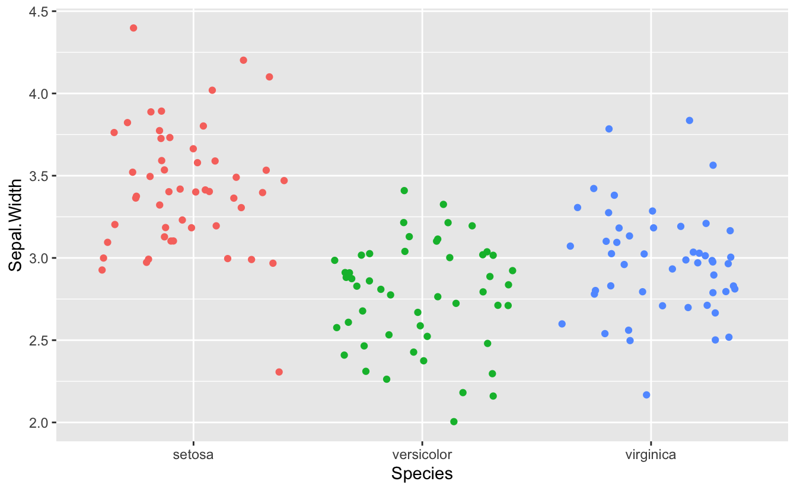
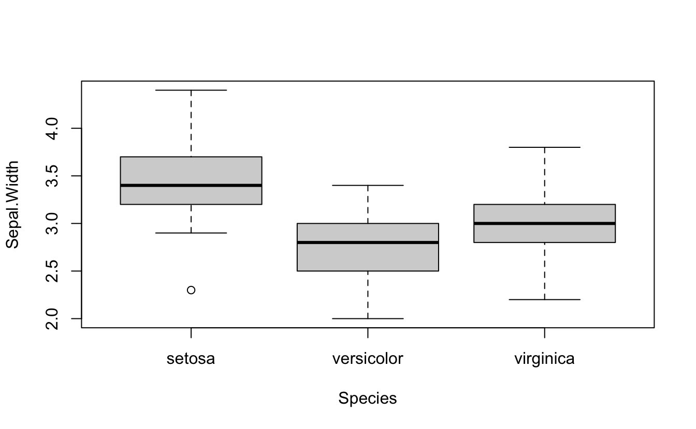

Introducción
------------

El análisis de varianza es una prueba estadística para determinar si dos o más medias poblacionales son diferentes entre si. En otras palabras, se usa para comparar dos o más grupos para ver si son significativamente diferentes.

En el resto del post lo comentaremos desde un punto de vista más práctico y en particular abordaremos los siguientes puntos:

-   el objetivo del análisis de varianza y cuándo debe usarse
-   cómo realizar el ANVA en R
-   cómo interpretar los resultados del ANVA
-   comprender la noción de prueba de promedios e interpretar los resultados
-   cómo visualizar los resultados de ANVA y pruebas de promedio

Datos
-----

El dato que se utilizará es `iris`, que se encuentra en la base de datos de R. Estos datos como tratamientos tienen tres especies (`setosa`, `versicolor` y `virginica`) y cuatro variables (`Sepal.Length`, `Sepal.Width`, `Petal.Length` y `Petal.Width`) cuantitativas

<pre class='chroma'><code class='language-r' data-lang='r'>#paquetes R a utilizar
<a href='https://rdrr.io/r/base/library.html'>library</a>(<a href='http://tidyverse.tidyverse.org'>tidyverse</a>)

#&gt; ── Attaching packages ─────────────────────────────────────── tidyverse 1.3.0 ──

#&gt; ✔ ggplot2 3.3.2     ✔ purrr   0.3.4
#&gt; ✔ tibble  3.0.4     ✔ dplyr   1.0.2
#&gt; ✔ tidyr   1.1.2     ✔ stringr 1.4.0
#&gt; ✔ readr   1.3.1     ✔ forcats 0.5.0

#&gt; ── Conflicts ────────────────────────────────────────── tidyverse_conflicts() ──
#&gt; ✖ dplyr::filter() masks stats::filter()
#&gt; ✖ dplyr::lag()    masks stats::lag()

<a href='https://rdrr.io/r/base/library.html'>library</a>(easyanova)
</code></pre>

La librería de `easyanova` es un paquete para realizar análisis de experimentos agrícolas y animales. Las funciones de esta librería son fáciles de usar. Realiza análisis en varios diseños, con datos balanceados y no balanceados.

Salida de datos a utilizar:

<pre class='chroma'><code class='language-r' data-lang='r'>#datos
tibble(iris)

#&gt; # A tibble: 150 x 5
#&gt;    Sepal.Length Sepal.Width Petal.Length Petal.Width Species
#&gt;           &lt;dbl&gt;       &lt;dbl&gt;        &lt;dbl&gt;       &lt;dbl&gt; &lt;fct&gt;  
#&gt;  1          5.1         3.5          1.4         0.2 setosa 
#&gt;  2          4.9         3            1.4         0.2 setosa 
#&gt;  3          4.7         3.2          1.3         0.2 setosa 
#&gt;  4          4.6         3.1          1.5         0.2 setosa 
#&gt;  5          5           3.6          1.4         0.2 setosa 
#&gt;  6          5.4         3.9          1.7         0.4 setosa 
#&gt;  7          4.6         3.4          1.4         0.3 setosa 
#&gt;  8          5           3.4          1.5         0.2 setosa 
#&gt;  9          4.4         2.9          1.4         0.2 setosa 
#&gt; 10          4.9         3.1          1.5         0.1 setosa 
#&gt; # … with 140 more rows
</code></pre>

<pre class='chroma'><code class='language-r' data-lang='r'>#inspección de datos
ggplot(iris) +
  aes(x = Species, y = Sepal.Width, color = Species) +
  geom_jitter() +
  theme(legend.position = "none")

</code></pre>

Objetivo del ANVA
-----------------

Como se mencionó en la introducción, el ANVA se usa para comparar grupos (en la práctica, 3 o más grupos). De manera más general, se utiliza para:

-   estudiar si las mediciones son similares en diferentes modalidades (también llamadas niveles o tratamientos en el contexto de ANVA) de una variable categórica
-   comparar el impacto de los diferentes niveles de una variable categórica sobre una variable cuantitativa
-   explicar una variable cuantitativa basada en una variable cualitativa

Supuestos subyacentes de ANVA
-----------------------------

Como ocurre con muchas pruebas estadísticas, hay algunas suposiciones que deben cumplirse para poder interpretar los resultados. Cuando no se cumplen uno o varios supuestos, aunque técnicamente es posible realizar estas pruebas, sería incorrecto interpretar los resultados y confiar en las conclusiones.

### 1. Tipo de variable

Las variables dependientes `Sepal.Length`, `Sepal.Width`, `Petal.Length` y `Petal.Width` es una variable **cuantitativa** y la variable independiente `Species` es **cualitativa** (con 3 niveles correspondientes a las 3 especies). Así que tenemos una combinación de los dos tipos de variables y se cumple este supuesto.

### 2. Independencia

Se asume la independencia de las observaciones ya que los datos se han recopilado de una parte de la población seleccionada al azar y las mediciones dentro y entre las 3 muestras no están relacionadas.

El supuesto de independencia se verifica con mayor frecuencia con base en el diseño del experimento y en el buen control de las condiciones experimentales, como es el caso aquí. Sin embargo, si realmente desea probarlo de manera más formal, puede probarlo mediante una prueba estadística: la prueba de Durbin-Watson (en R: [`durbinWatsonTest(res_lm)`](https://rdrr.io/pkg/car/man/durbinWatsonTest.html) donde `res_lm` es un modelo lineal). La hipótesis nula de esta prueba especifica un coeficiente de autocorrelación = 0, mientras que la hipótesis alternativa especifica un coeficiente de autocorrelación ≠ 0.

### 3. Normalidad

Recuerde que la **normalidad** de los residuos se puede probar visualmente mediante un histograma y un gráfico QQ, y/o formalmente mediante una prueba de normalidad (prueba de Shapiro-Wilk, por ejemplo).

Antes de verificar el supuesto de normalidad, primero debemos calcular el ANVA. Luego guardamos los resultados en `res_aov`:

<pre class='chroma'><code class='language-r' data-lang='r'>res_aov &lt;- <a href='https://rdrr.io/r/stats/aov.html'>aov</a>(Sepal.Width ~ Species,
  data = iris
)
</code></pre>

Ahora podemos comprobar la normalidad visualmente:

<pre class='chroma'><code class='language-r' data-lang='r'><a href='https://rdrr.io/r/graphics/par.html'>par</a>(mfrow = <a href='https://rdrr.io/r/base/c.html'>c</a>(1, 2)) # combine plots

# histogram
<a href='https://rdrr.io/r/graphics/hist.html'>hist</a>(res_aov$residuals)

# QQ-plot
<a href='https://rdrr.io/r/base/library.html'>library</a>(<a href='https://r-forge.r-project.org/projects/car/'>car</a>)

#&gt; Loading required package: carData

#&gt; 
#&gt; Attaching package: 'car'

#&gt; The following object is masked from 'package:dplyr':
#&gt; 
#&gt;     recode

#&gt; The following object is masked from 'package:purrr':
#&gt; 
#&gt;     some

<a href='https://rdrr.io/pkg/car/man/qqPlot.html'>qqPlot</a>(res_aov$residuals,
  id = FALSE # id = FALSE to remove point identification
)

</code></pre>

A partir del histograma y el gráfico QQ anteriores, ya podemos ver que el supuesto de normalidad parece cumplirse. De hecho, el histograma forma aproximadamente una curva de campana, lo que indica que los residuos siguen una distribución normal. Además, los puntos en las gráficas QQ siguen aproximadamente la línea recta y la mayoría de ellos están dentro de las bandas de confianza, lo que también indica que los residuos siguen aproximadamente una distribución normal.

Algunos investigadores se detienen aquí y asumen que se cumple la normalidad, mientras que otros también prueban la suposición a través de una prueba estadística formal. Es su elección probarlo *(i)* solo visualmente, *(ii)* solo a través de una prueba de normalidad, o *(iii)* tanto visualmente como a través de una prueba de normalidad. Sin embargo, tenga en cuenta los dos puntos siguientes:

> 1.  ANVA es bastante robusto a pequeñas desviaciones de la normalidad. Esto significa que no es un problema (desde la perspectiva de la interpretación de los resultados de ANVA) si un pequeño número de puntos se desvía ligeramente de la normalidad,
> 2.  Las pruebas de normalidad son a veces bastante conservadoras, lo que significa que la hipótesis nula de normalidad puede rechazarse debido a una desviación limitada de la normalidad. Este es especialmente el caso con muestras grandes, ya que la potencia de la prueba aumenta con el tamaño de la muestra.

En la práctica, se tiende a preferir el (i) enfoque visual solamente, pero nuevamente, esto es una cuestión de elección personal y también depende del contexto del análisis. Tambien, puede utilizar la prueba de Shapiro-Wilk o la prueba de Kolmogorov-Smirnov, entre otras.

### 4. Igualdad de varianzas - homogeneidad

Suponiendo que los residuos siguen una distribución normal, ahora es el momento de comprobar si las varianzas son iguales entre especies o no. El resultado tendrá un impacto en si usamos el ANVA o la prueba de Welch.

Esto se puede verificar nuevamente visualmente, a través de una gráfica de caja o gráfica de puntos, o más formalmente a través de una prueba estadística (la prueba de Levene, entre otras).

Visualmente tenemos:

<pre class='chroma'><code class='language-r' data-lang='r'># Boxplot
<a href='https://rdrr.io/r/graphics/boxplot.html'>boxplot</a>(Sepal.Width ~ Species,
  data = iris
)

</code></pre>

<pre class='chroma'><code class='language-r' data-lang='r'># Dotplot
<a href='https://rdrr.io/r/base/library.html'>library</a>(<a href='http://lattice.r-forge.r-project.org/'>"lattice"</a>)

<a href='https://rdrr.io/pkg/lattice/man/xyplot.html'>dotplot</a>(Sepal.Width ~ Species,
  data = iris
)

</code></pre>

Tanto la gráfica de boxplot como la gráfica de puntos muestran una variación similar para las diferentes especies. En el boxplot, esto se puede ver por el hecho de que las cajas y los bigotes tienen un tamaño comparable para todas las especies. Hay un par de valores atípicos como lo muestran los puntos fuera de los bigotes, pero esto no cambia el hecho de que la dispersión es más o menos la misma entre las diferentes especies.

En la gráfica de puntos, esto se puede ver por el hecho de que los puntos para las 3 especies tienen más o menos el mismo rango, un signo de la dispersión y, por lo tanto, la varianza es similar.

Al igual que el supuesto de normalidad, si cree que el enfoque visual no es suficiente, puede probar formalmente la igualdad de las varianzas con una prueba de *Levene* o de *Bartlett*. Observe que la prueba de Levene es menos sensible a las desviaciones de la distribución normal que la prueba de Bartlett.

Las hipótesis nula y alternativa para ambas pruebas son:

-   H0: las variaciones son iguales
-   H1: al menos una varianza es diferente

En R, la prueba de Levene se puede realizar gracias a la función [`leveneTest()`](https://rdrr.io/pkg/car/man/leveneTest.html) del paquete `{car}`:

<pre class='chroma'><code class='language-r' data-lang='r'># Levene's test
<a href='https://rdrr.io/r/base/library.html'>library</a>(<a href='https://r-forge.r-project.org/projects/car/'>car</a>)

<a href='https://rdrr.io/pkg/car/man/leveneTest.html'>leveneTest</a>(Sepal.Width ~ Species,
  data = iris
)

#&gt; Levene's Test for Homogeneity of Variance (center = median)
#&gt;        Df F value Pr(&gt;F)
#&gt; group   2  0.5902 0.5555
#&gt;       147
</code></pre>

Siendo el *p*-valor mayor que el nivel de significancia de 0.05, no rechazamos la hipótesis nula, por lo que no podemos rechazar la hipótesis de que las varianzas son iguales entre especies (*p*-valor = 0.556).

Este resultado también está en línea con el enfoque visual, por lo que la homogeneidad de las variaciones se cumple tanto visual como formalmente.

Análisis de varianza en R
-------------------------

El ANVA puede ayudarnos a hacer inferencias sobre la población dada la muestra en cuestión y ayudarnos a responder la pregunta de investigación "¿Existe diferencia en ancho de sépalo para las 3 especies?".

El ANVA en R se puede realizar de varias formas, de las cuales tres se presentan a continuación:

a). Con la función [`oneway.test()`](https://rdrr.io/r/stats/oneway.test.html):

<pre class='chroma'><code class='language-r' data-lang='r'># primer metodo:
<a href='https://rdrr.io/r/stats/oneway.test.html'>oneway.test</a>(Sepal.Width ~ Species,
  data = iris,
  var.equal = TRUE # asumiendo varianzas iguales
)

#&gt; 
#&gt;   One-way analysis of means
#&gt; 
#&gt; data:  Sepal.Width and Species
#&gt; F = 49.16, num df = 2, denom df = 147, p-value &lt; 2.2e-16
</code></pre>

b). Con las funciones de [`summary()`](https://rdrr.io/r/base/summary.html) y [`aov()`](https://rdrr.io/r/stats/aov.html):

<pre class='chroma'><code class='language-r' data-lang='r'># 2nd method:
res_aov &lt;- <a href='https://rdrr.io/r/stats/aov.html'>aov</a>(Sepal.Width ~ Species,
  data = iris
)

<a href='https://rdrr.io/r/base/summary.html'>summary</a>(res_aov)

#&gt;              Df Sum Sq Mean Sq F value Pr(&gt;F)    
#&gt; Species       2  11.35   5.672   49.16 &lt;2e-16 ***
#&gt; Residuals   147  16.96   0.115                   
#&gt; ---
#&gt; Signif. codes:  0 '***' 0.001 '**' 0.01 '*' 0.05 '.' 0.1 ' ' 1
</code></pre>

Como puede ver en los dos resultados anteriores, la estadística de prueba (F = en el primer método y el valor F en el segundo) y el *p*-valor (*p*-valor en el primer método y Pr (\> F) en el segundo) son exactamente iguales para ambos métodos, lo que significa que en caso de variaciones iguales, los resultados y las conclusiones no cambiarán.

La ventaja del primer método es que es fácil cambiar del ANVA (utilizado cuando las variaciones son iguales) a la prueba de Welch (utilizado cuando las variaciones son desiguales). Esto se puede hacer reemplazando `nvar.equal = TRUE` por `var.equal = FALSE`, como se presenta a continuación:

<pre class='chroma'><code class='language-r' data-lang='r'><a href='https://rdrr.io/r/stats/oneway.test.html'>oneway.test</a>(Sepal.Width ~ Species,
  data = iris,
  var.equal = FALSE # asumiendo variaciones desiguales
)

#&gt; 
#&gt;   One-way analysis of means (not assuming equal variances)
#&gt; 
#&gt; data:  Sepal.Width and Species
#&gt; F = 45.012, num df = 2.000, denom df = 97.402, p-value = 1.433e-14
</code></pre>

Sin embargo, la ventaja del segundo método es que:

-   Se imprime la tabla ANVA completa (con grados de libertad, cuadrados medios, etc.), lo que puede ser de interés en algunos casos (teóricos).
-   los resultados del ANVA (`res_aov`) se pueden guardar para su uso posterior (especialmente útil para pruebas de promedio)

### Interpretaciones de los resultados del ANVA

Dado que el p-valor es menor que 0.05, rechazamos la hipótesis nula, por lo que rechazamos la hipótesis de que todas las medias son iguales. Por tanto, podemos concluir que al menos una especie es diferente a las otras en términos del ancho de sépalo (*p*-valor \<2.2e-16).

### ¿Que sigue?

Si **no se rechaza la hipótesis nula** (*p*-valor ≥ 0,05), significa que no rechazamos la hipótesis de que todos los grupos son iguales. El ANVA más o menos se detiene aquí. Por supuesto, se pueden realizar otros tipos de análisis, pero, dados los datos disponibles, no pudimos probar que al menos un grupo fuera diferente, por lo que generalmente no avanzamos más con el ANVA.

Por el contrario, *si y solo si* se **rechaza la hipótesis nula** (como es nuestro caso ya que el *p*-valor \< 0.05), probamos que al menos un grupo es diferente. Podemos decidir detenernos aquí si solo estamos interesados en probar si todas las especies son iguales en términos de ancho de sépalo.

Pero la mayoría de las veces, cuando demostramos gracias a un ANVA que al menos un grupo es diferente, también nos interesa saber cuál es diferente. Para probar esto, necesitamos usar otros tipos de prueba, denominados pruebas de promedio o pruebas de comparación múltiple por pares. Esta familia de pruebas estadísticas es el tema de las siguientes secciones.

Pruebas de promedio en R y su interpretación
--------------------------------------------

Las pruebas de promedio son una familia de pruebas estadísticas, por lo que hay varias. Las más utilizadas son las pruebas **Tukey HSD** y **Dunnett**:

-   Tukey HSD se utiliza para comparar **todos los grupos** entre sí (por lo que todas las posibles comparaciones de 2 grupos).
-   Dunnett se utiliza para hacer comparaciones con un **grupo de referencia**. Por ejemplo, considere 2 grupos de tratamiento y un grupo de control. Si solo desea comparar los 2 grupos de tratamiento con respecto al grupo de control y no desea comparar los 2 grupos de tratamiento entre sí, se prefiere la prueba de Dunnett.

Ambas pruebas se presentan en las siguientes secciones.

### Prueba de Tukey HSD

En nuestro caso, dado que no existe una especie de "referencia" y nos interesa comparar todas las especies, vamos a utilizar la prueba de Tukey HSD.

En R, la prueba de Tukey HSD se realiza de la siguiente manera. Aquí es donde el *segundo método* para realizar el ANVA resulta útil porque los resultados (`res_aov`) se reutilizan para la prueba de promedios:

<pre class='chroma'><code class='language-r' data-lang='r'><a href='https://rdrr.io/r/base/library.html'>library</a>(<a href='http://multcomp.R-forge.R-project.org'>multcomp</a>)

#&gt; Loading required package: mvtnorm

#&gt; Loading required package: survival

#&gt; Loading required package: TH.data

#&gt; Loading required package: MASS

#&gt; 
#&gt; Attaching package: 'MASS'

#&gt; The following object is masked from 'package:dplyr':
#&gt; 
#&gt;     select

#&gt; 
#&gt; Attaching package: 'TH.data'

#&gt; The following object is masked from 'package:MASS':
#&gt; 
#&gt;     geyser

# Prueba de Tukey HSD:
post_test &lt;- <a href='https://rdrr.io/pkg/multcomp/man/glht.html'>glht</a>(res_aov,
  linfct = <a href='https://rdrr.io/pkg/multcomp/man/glht.html'>mcp</a>(Species = "Tukey")
)
<a href='https://rdrr.io/r/base/summary.html'>summary</a>(post_test)

#&gt; 
#&gt;    Simultaneous Tests for General Linear Hypotheses
#&gt; 
#&gt; Multiple Comparisons of Means: Tukey Contrasts
#&gt; 
#&gt; 
#&gt; Fit: aov(formula = Sepal.Width ~ Species, data = iris)
#&gt; 
#&gt; Linear Hypotheses:
#&gt;                             Estimate Std. Error t value Pr(&gt;|t|)    
#&gt; versicolor - setosa == 0    -0.65800    0.06794  -9.685  &lt; 1e-04 ***
#&gt; virginica - setosa == 0     -0.45400    0.06794  -6.683  &lt; 1e-04 ***
#&gt; virginica - versicolor == 0  0.20400    0.06794   3.003  0.00881 ** 
#&gt; ---
#&gt; Signif. codes:  0 '***' 0.001 '**' 0.01 '*' 0.05 '.' 0.1 ' ' 1
#&gt; (Adjusted p values reported -- single-step method)
</code></pre>

En el resultado de la prueba Tukey HSD, nos interesa la tabla que se muestra después de las `Hipótesis lineales`: más precisamente, en la primera y última columna de la tabla. La primera columna muestra las comparaciones que se han realizado; la última columna (`Pr(>|t|)`) muestra los *p*-valores ajustados para cada comparación (con la hipótesis nula siendo los dos grupos iguales y la hipótesis alternativa siendo los dos grupos diferentes).

Son estos *p*-valores ajustados los que se utilizan para probar si dos grupos son significativamente diferentes o no. En nuestro ejemplo, probamos:

1.  versicolor vs setosa (línea `versicolor - setosa == 0`)
2.  virginica vs setosa (línea `virginica - setosa == 0`)
3.  virginica vs versicolor (línea `virginica - versicolor == 0`)

Los tres p-valores son menores que 0.05, por lo que rechazamos la hipótesis nula para todas las comparaciones, lo que significa que todas las especies son **significativamente diferentes** en términos de ancho de sépalo.

Tenga en cuenta que la prueba Tukey HSD también se puede realizar en R con la función [`TukeyHSD()`](https://rdrr.io/r/stats/TukeyHSD.html):

<pre class='chroma'><code class='language-r' data-lang='r'><a href='https://rdrr.io/r/stats/TukeyHSD.html'>TukeyHSD</a>(res_aov)

#&gt;   Tukey multiple comparisons of means
#&gt;     95% family-wise confidence level
#&gt; 
#&gt; Fit: aov(formula = Sepal.Width ~ Species, data = iris)
#&gt; 
#&gt; $Species
#&gt;                        diff         lwr        upr     p adj
#&gt; versicolor-setosa    -0.658 -0.81885528 -0.4971447 0.0000000
#&gt; virginica-setosa     -0.454 -0.61485528 -0.2931447 0.0000000
#&gt; virginica-versicolor  0.204  0.04314472  0.3648553 0.0087802
</code></pre>

Con este código, es la columna `p adj` (también la última columna) la que interesa. Tenga en cuenta que las conclusiones son las mismas que las anteriores: todas las especies son significativamente diferentes en términos de ancho de sépalo.

Visualización de ANVA y pruebas de promedio
-------------------------------------------

Para realizar de forma más fácil un análisis de varianza, se puede usar la librería `easyanova` para analizar diferentes diseños experimentales.

### Análisis de varianza con `easyanova`

Para proceder con ANVA los datos de `iris` se selecciona y ordena para dar uso con el paquete `easyanova`.

<pre class='chroma'><code class='language-r' data-lang='r'>fsdata &lt;- iris %&gt;%
  dplyr::<a href='https://dplyr.tidyverse.org/reference/select.html'>select</a>(Species, Sepal.Width)
tibble(fsdata)

#&gt; # A tibble: 150 x 2
#&gt;    Species Sepal.Width
#&gt;    &lt;fct&gt;         &lt;dbl&gt;
#&gt;  1 setosa          3.5
#&gt;  2 setosa          3  
#&gt;  3 setosa          3.2
#&gt;  4 setosa          3.1
#&gt;  5 setosa          3.6
#&gt;  6 setosa          3.9
#&gt;  7 setosa          3.4
#&gt;  8 setosa          3.4
#&gt;  9 setosa          2.9
#&gt; 10 setosa          3.1
#&gt; # … with 140 more rows
</code></pre>

<pre class='chroma'><code class='language-r' data-lang='r'># Análisis de varianza para DCA

r1 &lt;- <a href='https://rdrr.io/pkg/easyanova/man/ea1.html'>ea1</a>(data = fsdata, # Base de datos
          design = 1, # Diseño experimental: 1=DCA, 2=DBCA, etc.
          alpha = 0.05) # Probabilidad estadística

</code></pre>

<pre class='chroma'><code class='language-r' data-lang='r'>r1

#&gt; $`Analysis of variance`
#&gt;             df type I SS mean square F value    p&gt;F
#&gt; treatments   2   11.3449      5.6725   49.16 &lt;0.001
#&gt; Residuals  147   16.9620      0.1154       -      -
#&gt; 
#&gt; $Means
#&gt;    treatment  mean standard.error tukey snk duncan t scott_knott
#&gt; 1     setosa 3.428          0.048     a   a      a a           a
#&gt; 2  virginica 2.974          0.048     b   b      b b           b
#&gt; 3 versicolor 2.770          0.048     c   c      c c           c
#&gt; 
#&gt; $`Multiple comparison test`
#&gt;                     pair contrast p(tukey) p(snk) p(duncan)   p(t)
#&gt; 1     setosa - virginica    0.454   0.0000 0.0000    0.0000 0.0000
#&gt; 2    setosa - versicolor    0.658   0.0000 0.0000    0.0000 0.0000
#&gt; 3 virginica - versicolor    0.204   0.0087 0.0031    0.0031 0.0031
#&gt; 
#&gt; $`Residual analysis`
#&gt; $`Residual analysis`$`residual analysis`
#&gt;                                values
#&gt; p.value Shapiro-Wilk test      0.3230
#&gt; p.value Bartlett test          0.3515
#&gt; coefficient of variation (%)  11.1100
#&gt; first value most discrepant   42.0000
#&gt; second value most discrepant  16.0000
#&gt; third value most discrepant  118.0000
#&gt; 
#&gt; $`Residual analysis`$residuals
#&gt;      1      2      3      4      5      6      7      8      9     10     11 
#&gt;  0.072 -0.428 -0.228 -0.328  0.172  0.472 -0.028 -0.028 -0.528 -0.328  0.272 
#&gt;     12     13     14     15     16     17     18     19     20     21     22 
#&gt; -0.028 -0.428 -0.428  0.572  0.972  0.472  0.072  0.372  0.372 -0.028  0.272 
#&gt;     23     24     25     26     27     28     29     30     31     32     33 
#&gt;  0.172 -0.128 -0.028 -0.428 -0.028  0.072 -0.028 -0.228 -0.328 -0.028  0.672 
#&gt;     34     35     36     37     38     39     40     41     42     43     44 
#&gt;  0.772 -0.328 -0.228  0.072  0.172 -0.428 -0.028  0.072 -1.128 -0.228  0.072 
#&gt;     45     46     47     48     49     50     51     52     53     54     55 
#&gt;  0.372 -0.428  0.372 -0.228  0.272 -0.128  0.430  0.430  0.330 -0.470  0.030 
#&gt;     56     57     58     59     60     61     62     63     64     65     66 
#&gt;  0.030  0.530 -0.370  0.130 -0.070 -0.770  0.230 -0.570  0.130  0.130  0.330 
#&gt;     67     68     69     70     71     72     73     74     75     76     77 
#&gt;  0.230 -0.070 -0.570 -0.270  0.430  0.030 -0.270  0.030  0.130  0.230  0.030 
#&gt;     78     79     80     81     82     83     84     85     86     87     88 
#&gt;  0.230  0.130 -0.170 -0.370 -0.370 -0.070 -0.070  0.230  0.630  0.330 -0.470 
#&gt;     89     90     91     92     93     94     95     96     97     98     99 
#&gt;  0.230 -0.270 -0.170  0.230 -0.170 -0.470 -0.070  0.230  0.130  0.130 -0.270 
#&gt;    100    101    102    103    104    105    106    107    108    109    110 
#&gt;  0.030  0.326 -0.274  0.026 -0.074  0.026  0.026 -0.474 -0.074 -0.474  0.626 
#&gt;    111    112    113    114    115    116    117    118    119    120    121 
#&gt;  0.226 -0.274  0.026 -0.474 -0.174  0.226  0.026  0.826 -0.374 -0.774  0.226 
#&gt;    122    123    124    125    126    127    128    129    130    131    132 
#&gt; -0.174 -0.174 -0.274  0.326  0.226 -0.174  0.026 -0.174  0.026 -0.174  0.826 
#&gt;    133    134    135    136    137    138    139    140    141    142    143 
#&gt; -0.174 -0.174 -0.374  0.026  0.426  0.126  0.026  0.126  0.126  0.126 -0.274 
#&gt;    144    145    146    147    148    149    150 
#&gt;  0.226  0.326  0.026 -0.474  0.026  0.426  0.026 
#&gt; 
#&gt; $`Residual analysis`$`standardized residuals`
#&gt;           1           2           3           4           5           6 
#&gt;  0.21339641 -1.26852308 -0.67575529 -0.97213918  0.50978030  1.39893200 
#&gt;           7           8           9          10          11          12 
#&gt; -0.08298749 -0.08298749 -1.56490698 -0.97213918  0.80616420 -0.08298749 
#&gt;          13          14          15          16          17          18 
#&gt; -1.26852308 -1.26852308  1.69531589  2.88085148  1.39893200  0.21339641 
#&gt;          19          20          21          22          23          24 
#&gt;  1.10254810  1.10254810 -0.08298749  0.80616420  0.50978030 -0.37937139 
#&gt;          25          26          27          28          29          30 
#&gt; -0.08298749 -1.26852308 -0.08298749  0.21339641 -0.08298749 -0.67575529 
#&gt;          31          32          33          34          35          36 
#&gt; -0.97213918 -0.08298749  1.99169979  2.28808369 -0.97213918 -0.67575529 
#&gt;          37          38          39          40          41          42 
#&gt;  0.21339641  0.50978030 -1.26852308 -0.08298749  0.21339641 -3.34321036 
#&gt;          43          44          45          46          47          48 
#&gt; -0.67575529  0.21339641  1.10254810 -1.26852308  1.10254810 -0.67575529 
#&gt;          49          50          51          52          53          54 
#&gt;  0.80616420 -0.37937139  1.27445076  1.27445076  0.97806686 -1.39300432 
#&gt;          55          56          57          58          59          60 
#&gt;  0.08891517  0.08891517  1.57083466 -1.09662042  0.38529907 -0.20746873 
#&gt;          61          62          63          64          65          66 
#&gt; -2.28215601  0.68168296 -1.68938822  0.38529907  0.38529907  0.97806686 
#&gt;          67          68          69          70          71          72 
#&gt;  0.68168296 -0.20746873 -1.68938822 -0.80023652  1.27445076  0.08891517 
#&gt;          73          74          75          76          77          78 
#&gt; -0.80023652  0.08891517  0.38529907  0.68168296  0.08891517  0.68168296 
#&gt;          79          80          81          82          83          84 
#&gt;  0.38529907 -0.50385263 -1.09662042 -1.09662042 -0.20746873 -0.20746873 
#&gt;          85          86          87          88          89          90 
#&gt;  0.68168296  1.86721855  0.97806686 -1.39300432  0.68168296 -0.80023652 
#&gt;          91          92          93          94          95          96 
#&gt; -0.50385263  0.68168296 -0.50385263 -1.39300432 -0.20746873  0.68168296 
#&gt;          97          98          99         100         101         102 
#&gt;  0.38529907  0.38529907 -0.80023652  0.08891517  0.96621151 -0.81209188 
#&gt;         103         104         105         106         107         108 
#&gt;  0.07705981 -0.21932408  0.07705981  0.07705981 -1.40485967 -0.21932408 
#&gt;         109         110         111         112         113         114 
#&gt; -1.40485967  1.85536320  0.66982761 -0.81209188  0.07705981 -1.40485967 
#&gt;         115         116         117         118         119         120 
#&gt; -0.51570798  0.66982761  0.07705981  2.44813099 -1.10847578 -2.29401137 
#&gt;         121         122         123         124         125         126 
#&gt;  0.66982761 -0.51570798 -0.51570798 -0.81209188  0.96621151  0.66982761 
#&gt;         127         128         129         130         131         132 
#&gt; -0.51570798  0.07705981 -0.51570798  0.07705981 -0.51570798  2.44813099 
#&gt;         133         134         135         136         137         138 
#&gt; -0.51570798 -0.51570798 -1.10847578  0.07705981  1.26259540  0.37344371 
#&gt;         139         140         141         142         143         144 
#&gt;  0.07705981  0.37344371  0.37344371  0.37344371 -0.81209188  0.66982761 
#&gt;         145         146         147         148         149         150 
#&gt;  0.96621151  0.07705981 -1.40485967  0.07705981  1.26259540  0.07705981
</code></pre>

En la salida se puede observar el resultado de `análisis de varianza`, `prueba de promedios` y `comparación múltiple de medias`. Estas salidas son muy fáciles de obtener y poder interpretar las mismas. Asimismo, se puede verificar la `normalidad` y `coeficiente de variación` de los datos.

### Visualización de la prueba de promedios

Si está interesado en incluir resultados de ANVA y pruebas de promedio directamente en los boxplot, aquí hay un fragmento de código que puede ser de su interés:

<pre class='chroma'><code class='language-r' data-lang='r'>#paquete para p-valor en la visualización de prueba de promedios
<a href='https://rdrr.io/r/base/library.html'>library</a>(<a href='https://rpkgs.datanovia.com/ggpubr/'>ggpubr</a>)
dat &lt;- iris
# Editar desde aquí
x &lt;- <a href='https://rdrr.io/r/base/which.html'>which</a>(<a href='https://rdrr.io/r/base/names.html'>names</a>(dat) == "Species") #variable de agrupación
y &lt;- <a href='https://rdrr.io/r/base/which.html'>which</a>(<a href='https://rdrr.io/r/base/names.html'>names</a>(dat) == "Sepal.Width") #variables para la prueba de promedios
          #| names(dat) == "Sepal.Length"
          #| names(dat) == "Petal.Length"
          #| names(dat) == "Petal.Width")
method1 &lt;- "anova" # Una de "anova" o "kruskal.test"
method2 &lt;- "t.test" # Una de "wilcox.test" o "t.test"
my_comparisons &lt;- <a href='https://rdrr.io/r/base/list.html'>list</a>(<a href='https://rdrr.io/r/base/c.html'>c</a>("setosa", "versicolor"), <a href='https://rdrr.io/r/base/c.html'>c</a>("setosa", "virginica"), <a href='https://rdrr.io/r/base/c.html'>c</a>("versicolor", "virginica")) # comparaciones para pruebas de promedio
# Editar hasta aquí

# Edit at your own risk
for (i in y) {
  for (j in x) {
    p &lt;- <a href='https://rpkgs.datanovia.com/ggpubr/reference/ggboxplot.html'>ggboxplot</a>(dat,
      x = <a href='https://rdrr.io/r/base/colnames.html'>colnames</a>(dat[j]), y = <a href='https://rdrr.io/r/base/colnames.html'>colnames</a>(dat[i]),
      color = <a href='https://rdrr.io/r/base/colnames.html'>colnames</a>(dat[j]),
      legend = "none",
      palette = "npg",
      add = "jitter"
    )
    <a href='https://rdrr.io/r/base/print.html'>print</a>(
      p + <a href='https://rpkgs.datanovia.com/ggpubr/reference/stat_compare_means.html'>stat_compare_means</a>(aes(label = <a href='https://rdrr.io/r/base/paste.html'>paste0</a>(..method.., ", p-value = ", ..p.format..)),
        method = method1, label.y = <a href='https://rdrr.io/r/base/Extremes.html'>max</a>(dat[, i], na.rm = TRUE)
      )
      + <a href='https://rpkgs.datanovia.com/ggpubr/reference/stat_compare_means.html'>stat_compare_means</a>(comparisons = my_comparisons, method = method2, label = "p.format") # remove if p-value of ANOVA or Kruskal-Wallis test &gt;= alpha
    )
  }
}

</code></pre>

Otra opción de gráfica para observar la significancia entre las medias de cada par de especies.

<pre class='chroma'><code class='language-r' data-lang='r'># pairwise comparisons
<a href='https://rdrr.io/r/base/library.html'>library</a>(<a href='https://rpkgs.datanovia.com/rstatix/'>rstatix</a>)

#&gt; 
#&gt; Attaching package: 'rstatix'

#&gt; The following object is masked from 'package:MASS':
#&gt; 
#&gt;     select

#&gt; The following object is masked from 'package:stats':
#&gt; 
#&gt;     filter

pwc &lt;- fsdata %&gt;%
  <a href='https://rpkgs.datanovia.com/rstatix/reference/t_test.html'>pairwise_t_test</a>(
    Sepal.Width ~ Species, pool.sd = FALSE,
    p.adjust.method = "none"
    )

# Visualization: box plots with p-values
pwc &lt;- pwc %&gt;% <a href='https://rpkgs.datanovia.com/rstatix/reference/get_pvalue_position.html'>add_xy_position</a>(x = "Species")
<a href='https://rpkgs.datanovia.com/ggpubr/reference/ggboxplot.html'>ggboxplot</a>(fsdata, x = "Species", y = "Sepal.Width",
          color = "Species", 
          legend = "none", 
          add = "jitter") +
  <a href='https://rpkgs.datanovia.com/ggpubr/reference/stat_pvalue_manual.html'>stat_pvalue_manual</a>(pwc, hide.ns = TRUE) 

</code></pre>

Conclusión
----------

La figura de prueba de promedios es muy buena opción para incluir en la sección de resultados de los reportes de investigación. La figura incluye el resultado de p-valor del análisis de varianza, además, p-valor para la comparación de medias entre especies o tratamientos de la investigación.

Referencias
-----------

1.  R bloggers 2020. [ANOVA in R](https://www.r-bloggers.com/2020/10/anova-in-r/)
2.  Soetewey A. 2020. [How to do a t-test or ANOVA for more than one variable at once in R](https://towardsdatascience.com/how-to-do-a-t-test-or-anova-for-many-variables-at-once-in-r-and-communicate-the-results-in-a-6defaa712e5)

