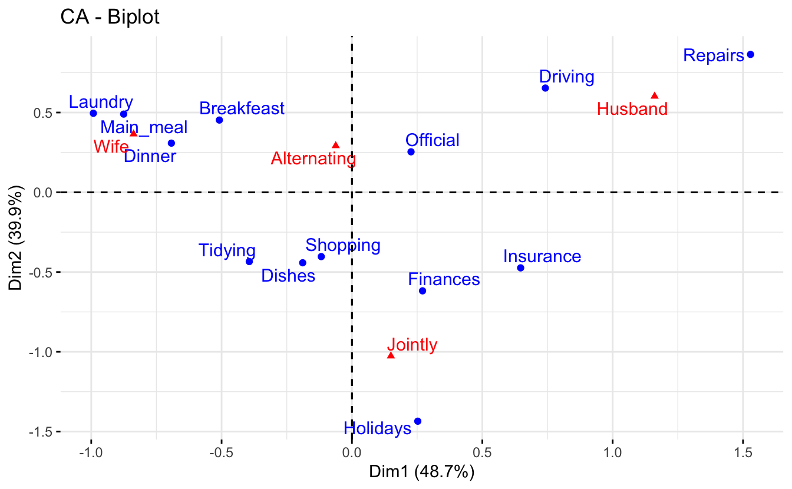
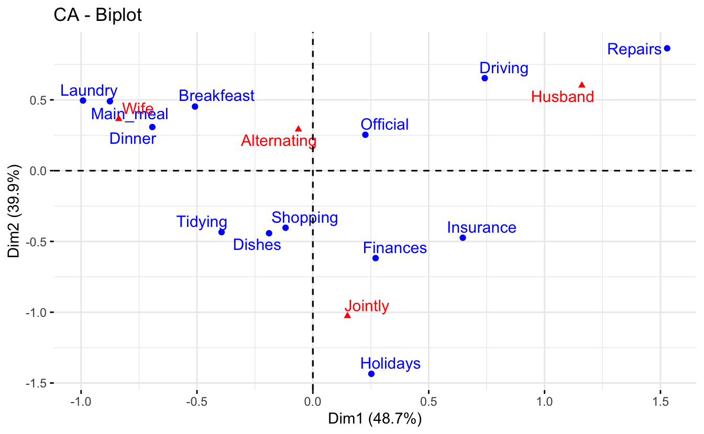
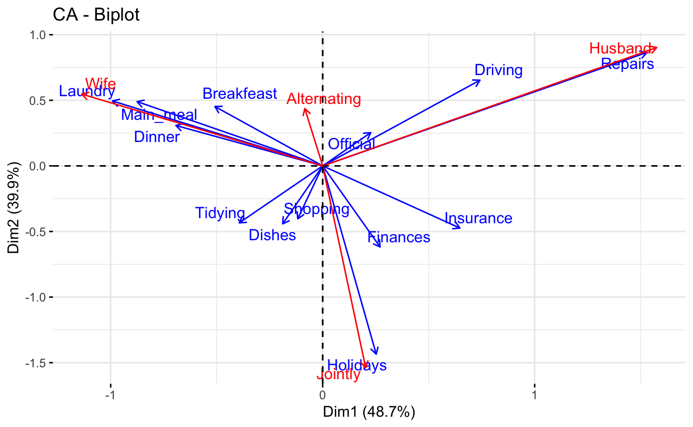
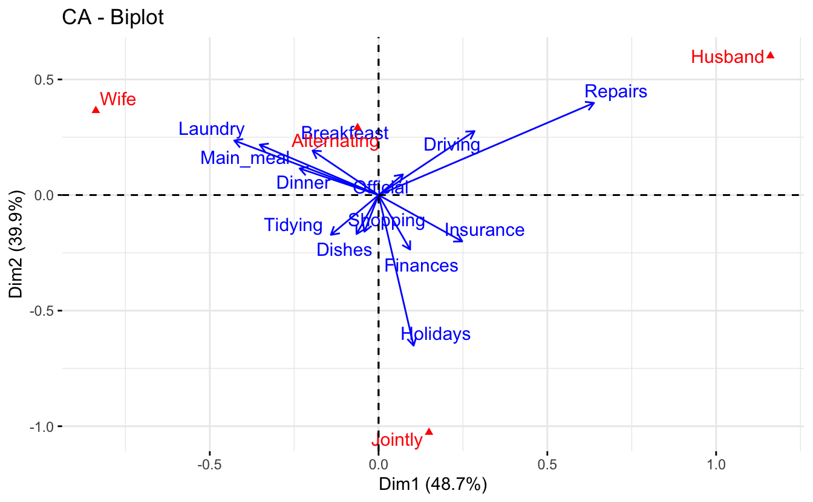

Introducción
------------

El **análisis de correspondencia (CA)** es una extensión del análisis de componentes principales `(Capítulo 4)` adecuado para explorar relaciones entre variables cualitativas (o datos categóricos). Al igual que el análisis de componentes principales, proporciona una solución para resumir y visualizar conjuntos de datos en gráficos de dos dimensiones.

Aquí, describimos el análisis de correspondencia simple, que se utiliza para analizar frecuencias formadas por dos datos categóricos, una tabla de datos conocida como *tabla de contingencia*, tambien se conoce como **tablas cruzadas**. Proporciona puntuaciones de factores (coordenadas) para los puntos de fila y columna de la tabla de contingencia. Estas coordenadas se utilizan para visualizar gráficamente la asociación entre elementos de fila y columna en la tabla de contingencia.

Al analizar una tabla de contingencia bidireccional, una pregunta típica es si ciertos elementos de fila están asociados con algunos elementos de elementos de columna. El análisis de correspondencia es un enfoque geométrico para visualizar las filas y columnas de una tabla de contingencia bidireccional como puntos en un espacio de baja dimensión, de modo que las posiciones de los puntos de fila y columna sean consistentes con sus asociaciones en la tabla. El objetivo es tener una visión global de los datos que sea útil para la interpretación.

En el capítulo actual, mostraremos cómo calcular e interpretar el análisis de correspondencia usando dos `paquetes R`: i) `FactoMineR` para el análisis y ii) `factoextra` para la visualización de datos. Además, mostraremos cómo revelar las variables más importantes que explican las variaciones en un conjunto de datos.

Procedimiento computacional en R
--------------------------------

Cargar paquetes

<pre class='chroma'><code class='language-r' data-lang='r'><a href='https://rdrr.io/r/base/library.html'>library</a>(<a href='http://factominer.free.fr'>FactoMineR</a>)
<a href='https://rdrr.io/r/base/library.html'>library</a>(<a href='http://www.sthda.com/english/rpkgs/factoextra'>factoextra</a>)

#&gt; Loading required package: ggplot2

#&gt; Welcome! Want to learn more? See two factoextra-related books at https://goo.gl/ve3WBa
</code></pre>

### Formato de datos

Los datos deben ser una tabla de contingencia (resultados de tablas cruzadas). Usaremos los conjuntos de datos de demostración de tareas domésticas disponibles en el paquete factoextra R.

<pre class='chroma'><code class='language-r' data-lang='r'><a href='https://rdrr.io/r/utils/data.html'>data</a>(housetasks)
</code></pre>

Los datos son una tabla de contingencia que contiene 13 tareas del hogar y su reparto en la pareja:

-   las filas son las diferentes tareas
-   Los valores son las frecuencias de las tareas realizadas:
    -   solo por la esposa "wife only"
    -   alternativamente "Alternating"
    -   solo por el marido "husband only"
    -   o conjuntamente \"jointly

Los datos se ilustran en la siguiente salidad:

<pre class='chroma'><code class='language-r' data-lang='r'>#&gt;            Wife Alternating Husband Jointly
#&gt; Laundry     156          14       2       4
#&gt; Main_meal   124          20       5       4
#&gt; Dinner       77          11       7      13
#&gt; Breakfeast   82          36      15       7
#&gt; Tidying      53          11       1      57
#&gt; Dishes       32          24       4      53
#&gt; Shopping     33          23       9      55
#&gt; Official     12          46      23      15
#&gt; Driving      10          51      75       3
#&gt; Finances     13          13      21      66
#&gt; Insurance     8           1      53      77
#&gt; Repairs       0           3     160       2
#&gt; Holidays      0           1       6     153
</code></pre>

### Gráfica de tablas de contingencia y prueba de chi-cuadrado

La tabla de contingencia anterior no es muy grande. Por lo tanto, es fácil inspeccionar e interpretar visualmente los perfiles de filas y columnas:

-   Es evidente que las tareas de la casa (lavandería, comida principal y cena) las realiza con más frecuencia la "esposa".
-   Las reparaciones y la conducción las realiza predominantemente el marido.
-   Los días festivos se asocian con frecuencia con la columna "conjuntamente"

El análisis de datos exploratorios y la visualización de tablas de contingencia se cubrieron en nuestro artículo anterior: [Prueba de independencia de chi-cuadrado](htpp:/) en R. Brevemente, la tabla de contingencia se puede visualizar utilizando las funciones [`balloonplot()`](https://rdrr.io/pkg/gplots/man/balloonplot.html) \[paquete gplots\] y [`mosaicplot()`](https://rdrr.io/r/graphics/mosaicplot.html) \[paquete garphics\]:

<pre class='chroma'><code class='language-r' data-lang='r'><a href='https://rdrr.io/r/base/library.html'>library</a>(<a href='https://github.com/talgalili/gplots'>gplots</a>)

#&gt; 
#&gt; Attaching package: 'gplots'

#&gt; The following object is masked from 'package:stats':
#&gt; 
#&gt;     lowess

#1. Convierte el dato como una tabla
dt &lt;- <a href='https://rdrr.io/r/base/table.html'>as.table</a>(<a href='https://rdrr.io/r/base/matrix.html'>as.matrix</a>(housetasks))
# 2. Graph
<a href='https://rdrr.io/pkg/gplots/man/balloonplot.html'>balloonplot</a>(<a href='https://rdrr.io/r/base/t.html'>t</a>(dt), main ="housetasks", xlab ="", ylab="",
            label = FALSE, show.margins = FALSE)

</code></pre>

> Tenga en cuenta que las sumas de filas y columnas se imprimen de forma predeterminada en los márgenes inferior y derecho, respectivamente. Estos valores están ocultos, en el gráfico anterior, utilizando el argumento show.margins = FALSE.

Para una tabla de contingencia pequeña, puede utilizar la prueba de chi-cuadrado para evaluar si existe una dependencia significativa entre las categorías de filas y columnas:

<pre class='chroma'><code class='language-r' data-lang='r'>chisq &lt;- <a href='https://rdrr.io/r/stats/chisq.test.html'>chisq.test</a>(housetasks)
chisq

#&gt; 
#&gt;   Pearson's Chi-squared test
#&gt; 
#&gt; data:  housetasks
#&gt; X-squared = 1944.5, df = 36, p-value &lt; 2.2e-16
</code></pre>

> En nuestro ejemplo, las variables de fila y columna están asociadas de manera estadísticamente significativa (`*valor p* = r chisq$p.value`).

### Código R para calcular CA (Analisis de Correspondencia)

Se puede utilizar la función [`CA()`](https://rdrr.io/pkg/FactoMineR/man/CA.html) \[*paquete FactoMiner*\]. Un formato simplificado es:

<pre class='chroma'><code class='language-r' data-lang='r'>CA(X, ncp = 5, graph = TRUE)
</code></pre>

> -   **X**: es un marco de datos (tabla de contingencia)
> -   **ncp**: número de dimensiones mantenidas en los resultados finales.
> -   **graph**: un valor lógico. Si es TRUE, se muestra un gráfico.

Para calcular el análisis de correspondencia, escriba esto:

<pre class='chroma'><code class='language-r' data-lang='r'><a href='https://rdrr.io/r/base/library.html'>library</a>(<a href='http://factominer.free.fr'>"FactoMineR"</a>)
#housetasks es nuestro marco de datos
res.ca &lt;- <a href='https://rdrr.io/pkg/FactoMineR/man/CA.html'>CA</a>(housetasks, graph = FALSE)
</code></pre>

La salida de la función CA () es una lista que incluye:

<pre class='chroma'><code class='language-r' data-lang='r'><a href='https://rdrr.io/r/base/print.html'>print</a>(res.ca)

#&gt; **Results of the Correspondence Analysis (CA)**
#&gt; The row variable has  13  categories; the column variable has 4 categories
#&gt; The chi square of independence between the two variables is equal to 1944.456 (p-value =  0 ).
#&gt; *The results are available in the following objects:
#&gt; 
#&gt;    name              description                   
#&gt; 1  "$eig"            "eigenvalues"                 
#&gt; 2  "$col"            "results for the columns"     
#&gt; 3  "$col$coord"      "coord. for the columns"      
#&gt; 4  "$col$cos2"       "cos2 for the columns"        
#&gt; 5  "$col$contrib"    "contributions of the columns"
#&gt; 6  "$row"            "results for the rows"        
#&gt; 7  "$row$coord"      "coord. for the rows"         
#&gt; 8  "$row$cos2"       "cos2 for the rows"           
#&gt; 9  "$row$contrib"    "contributions of the rows"   
#&gt; 10 "$call"           "summary called parameters"   
#&gt; 11 "$call$marge.col" "weights of the columns"      
#&gt; 12 "$call$marge.row" "weights of the rows"
</code></pre>

> El objeto que se crea usando la función [`CA()`](https://rdrr.io/pkg/FactoMineR/man/CA.html) contiene mucha información que se encuentra en muchas listas y matrices diferentes. Estos valores se describen en la siguiente sección.

Visualización e interpretación
------------------------------

Usaremos las siguientes funciones \[in *factoextra*\] para ayudar en la interpretación y visualización del análisis de correspondencia:

-   [`get_eigenvalue(res.ca)`](https://rdrr.io/pkg/factoextra/man/eigenvalue.html): Extraiga los autovalores/varianzas retenidos por cada dimensión (eje)
-   [`fviz_eig(res.ca)`](https://rdrr.io/pkg/factoextra/man/eigenvalue.html): Visualiza los valores propios
-   [`get_ca_row(res.ca)`](https://rdrr.io/pkg/factoextra/man/get_ca.html), [`get_ca_col(res.ca)`](https://rdrr.io/pkg/factoextra/man/get_ca.html): Extrae los resultados para filas y columnas, respectivamente.
-   [`fviz_ca_row(res.ca)`](https://rdrr.io/pkg/factoextra/man/fviz_ca.html), [`fviz_ca_col(res.ca)`](https://rdrr.io/pkg/factoextra/man/fviz_ca.html): Visualiza los resultados para filas y columnas, respectivamente.
-   [`fviz_ca_biplot(res.ca)`](https://rdrr.io/pkg/factoextra/man/fviz_ca.html): Crea un biplot de filas y columnas.

En las siguientes secciones, ilustraremos cada una de estas funciones.

### Significación estadística

Para interpretar el análisis de correspondencia, el primer paso es evaluar si existe una dependencia significativa entre las filas y las columnas.

Un método riguroso consiste en utilizar la **estadística de chi-cuadrado** para examinar la asociación entre las variables de fila y columna. Esto aparece en la parte superior y es generado por la función [`summary(res.ca)`](https://rdrr.io/r/base/summary.html) o [`print(res.ca)`](https://rdrr.io/r/base/print.html), ver sección "Gráfica de tablas de contingencia y prueba de chi-cuadrado". Una estadística de `chi-cuadrado alta` significa un vínculo fuerte entre las variables de fila y columna o sea, la probabilidad de chi cuadrado deberá ser inferior a 0.05.

> En nuestro ejemplo, la asociación es muy significativa (chi-cuadrado: 1944,456, p = 0).

<pre class='chroma'><code class='language-r' data-lang='r'># Chi-square statistics
chi2 &lt;- 1944.456
chi2

#&gt; [1] 1944.456

# Degree of freedom
df &lt;- (<a href='https://rdrr.io/r/base/nrow.html'>nrow</a>(housetasks) - 1) * (<a href='https://rdrr.io/r/base/nrow.html'>ncol</a>(housetasks) - 1)
df

#&gt; [1] 36

# P-value
pval &lt;- <a href='https://rdrr.io/r/stats/Chisquare.html'>pchisq</a>(chi2, df = df, lower.tail = FALSE)
pval

#&gt; [1] 0
</code></pre>

### Valores propios/Varianzas

Recuerde que examinamos los valores propios para determinar el número de ejes a considerar. Los valores propios y la proporción de varianzas retenidas por los diferentes ejes se pueden extraer utilizando la función [`get_eigenvalue()`](https://rdrr.io/pkg/factoextra/man/eigenvalue.html) \[paquete *factoextra*\]. Los *valores propios* son grandes para el primer eje y pequeños para el eje siguiente.

<pre class='chroma'><code class='language-r' data-lang='r'><a href='https://rdrr.io/r/base/library.html'>library</a>(<a href='http://www.sthda.com/english/rpkgs/factoextra'>"factoextra"</a>)
eig.val &lt;- <a href='https://rdrr.io/pkg/factoextra/man/eigenvalue.html'>get_eigenvalue</a>(res.ca)
eig.val

#&gt;       eigenvalue variance.percent cumulative.variance.percent
#&gt; Dim.1  0.5428893         48.69222                    48.69222
#&gt; Dim.2  0.4450028         39.91269                    88.60491
#&gt; Dim.3  0.1270484         11.39509                   100.00000
</code></pre>

Los *valores propios* corresponden a la cantidad de información retenida por cada eje. Las dimensiones se ordenan de forma decreciente y se enumeran de acuerdo con la cantidad de variación explicada en la solución. La dimensión 1 explica la mayor variación en la solución, seguida de la dimensión 2 y así sucesivamente.

El porcentaje acumulado explicado se obtiene sumando las sucesivas proporciones de variación explicadas para obtener el total acumulado. Por ejemplo, 48,69% más 39,91% es igual a 88,6% y así sucesivamente. Por lo tanto, aproximadamente el 88,6% de la variación se explica por las dos primeras dimensiones.

Los valores propios se pueden utilizar para determinar el número de ejes que se deben retener. No existe una "regla general" para elegir el número de dimensiones que se deben mantener para la interpretación de los datos. Depende de la pregunta de investigación y la necesidad del investigador. Por ejemplo, si está satisfecho con el 80% de las variaciones totales explicadas, utilice la cantidad de dimensiones necesarias para lograrlo.

> Tenga en cuenta que se logra una buena reducción de dimensión cuando las primeras dimensiones representan una gran proporción de la variabilidad.

En nuestro análisis, los dos primeros ejes explican el 88,6% de la variación. Este es un porcentaje aceptablemente grande.

Un método alternativo para determinar el número de dimensiones es mirar una gráfica de `Scree Plot`, que es el diagrama de valores propios/varianzas ordenados de mayor a menor. El número de componentes se determina en el punto, más allá del cual los valores propios restantes son todos relativamente pequeños y de tamaño comparable.

El gráfico `Scree plot` se puede realizar usando la función [`fviz_eig()`](https://rdrr.io/pkg/factoextra/man/eigenvalue.html) o [`fviz_screeplot()`](https://rdrr.io/pkg/factoextra/man/eigenvalue.html) \[paquete factoextra\].

<pre class='chroma'><code class='language-r' data-lang='r'><a href='https://rdrr.io/pkg/factoextra/man/eigenvalue.html'>fviz_screeplot</a>(res.ca, addlabels = TRUE, ylim = <a href='https://rdrr.io/r/base/c.html'>c</a>(0, 50))

</code></pre>

> Se puede considerar que el punto en el que el gráfico de pedregal muestra una curvatura (denominado "codo") indica una dimensionalidad óptima.

También es posible calcular un valor propio promedio por encima del cual el eje debe mantenerse en la solución.

> -   Nuestros datos contienen 13 filas y 4 columnas.
> -   Si los datos fueran aleatorios, el valor esperado del valor propio para cada eje sería `1/(nrow(housetasks)-1) = 1/12 = 8,33%` en términos de filas.
> -   Asimismo, el eje promedio debe representar `1/(ncol(housetasks)-1) = 1/3 = 33,33%` en términos de las 4 columnas.

Según (M. T. Bendixen 1995): \>Cualquier eje con una contribución mayor que el máximo de estos dos porcentajes debe ser considerado como importante e incluido en la solución para la interpretación de los datos.

El código R a continuación, dibuja el gráfico de pantalla con una línea discontinua roja que especifica el valor propio promedio:

<pre class='chroma'><code class='language-r' data-lang='r'><a href='https://rdrr.io/pkg/factoextra/man/eigenvalue.html'>fviz_screeplot</a>(res.ca) +
  geom_hline(yintercept=33.33, linetype=2, color="red")

</code></pre>

Según el gráfico anterior, solo las dimensiones 1 y 2 deben usarse en la solución. La dimensión 3 explica sólo el 11,4% de la inercia total, que está por debajo del valor propio medio (33,33%) y es demasiado poco para guardarlo para un análisis más detallado.

> Tenga en cuenta que puede utilizar más de 2 dimensiones. Sin embargo, es poco probable que las dimensiones complementarias contribuyan de manera significativa a la interpretación de la naturaleza de la asociación entre filas y columnas.

Las dimensiones 1 y 2 explican aproximadamente el 48,7% y el 39,9% de la inercia total, respectivamente. Esto corresponde a un total acumulado del 88,6% de la inercia total retenida por las 2 dimensiones. Cuanto mayor sea la retención, más sutileza en los datos originales se retiene en la solución de baja dimensión (M. Bendixen 2003).

### Biplot

La función [`fviz_ca_biplot()`](https://rdrr.io/pkg/factoextra/man/fviz_ca.html) \[paquete factoextra\] se puede utilizar para dibujar el biplot de las variables de filas y columnas.

<pre class='chroma'><code class='language-r' data-lang='r'># repel= TRUE para evitar la superposición de texto (lenta si tiene muchos puntos)
<a href='https://rdrr.io/pkg/factoextra/man/fviz_ca.html'>fviz_ca_biplot</a>(res.ca, repel = TRUE)

</code></pre>

El gráfico anterior se llama gráfico simétrico y muestra un patrón global dentro de los datos. Las filas están representadas por puntos azules y las columnas por triángulos rojos.

La distancia entre cualquier punto de fila o columna da una medida de su similitud (o disimilitud). Los puntos de fila con un perfil similar se cierran en el mapa de factores. Lo mismo es válido para los puntos de columna.

> -   Este gráfico muestra que:
> -   Las tareas de la casa, como la cena, el desayuno y la ropa, las hace la esposa con más frecuencia.
> -   La conducción y las reparaciones las realiza el marido.

> -   El *gráfico simétrico* representa los perfiles de fila y columna simultáneamente en un espacio común. En este caso, solo se puede interpretar realmente la distancia entre puntos de fila o la distancia entre puntos de columna.
> -   ¡La distancia entre cualquier elemento de fila y columna no es significativa! Solo puede hacer declaraciones generales sobre el patrón observado.
> -   Para interpretar la distancia entre los puntos de columna y fila, los perfiles de columna deben presentarse en el espacio de fila o viceversa. Este tipo de mapa se llama biplot asimétrico y se analiza al final de este artículo.

El siguiente paso para la interpretación es determinar qué variables de fila y columna contribuyen más en la definición de las diferentes dimensiones retenidas en el modelo.

### Opciones de biplot

Biplot es una visualización gráfica de filas y columnas en 2 o 3 dimensiones. Ya hemos descrito cómo crear CA biplots en la sección anterior. Aquí, describiremos diferentes tipos de biplots de CA.

#### Biplot simétrico

Como se mencionó anteriormente, el gráfico estándar del análisis de correspondencia es un biplot simétrico en el que tanto las filas (puntos azules) como las columnas (triángulos rojos) se representan en el mismo espacio utilizando las coordenadas principales. Estas coordenadas representan los perfiles de fila y columna. En este caso, solo se puede interpretar realmente la distancia entre puntos de fila o la distancia entre puntos de columna.

> Con la gráfica simétrica, la distancia entre filas y columnas no se puede interpretar. Solo se pueden hacer declaraciones generales sobre el patrón.

<pre class='chroma'><code class='language-r' data-lang='r'><a href='https://rdrr.io/pkg/factoextra/man/fviz_ca.html'>fviz_ca_biplot</a>(res.ca, repel = TRUE)

</code></pre>

> Tenga en cuenta que, para interpretar la distancia entre los puntos de la columna y los puntos de la fila, la forma más sencilla es hacer una gráfica asimétrica. Esto significa que los perfiles de columna deben presentarse en el espacio de la fila o viceversa.

#### Biplot asimétrico

Para hacer un *biplot asimétrico*, los puntos de las filas (o columnas) se trazan a partir de las coordenadas estándar (S) y los perfiles de las columnas (o las filas) se trazan a partir de las coordenadas principales (P) (M. Bendixen 2003).

Para un eje dado, las coordenadas estándar y principal se relacionan de la siguiente manera:

P = sqrt(valor propio) X S

-   *P*: la coordenada principal de una fila (o una columna) en el eje
-   *valor propio*: el valor propio del eje

Dependiendo de la situación, se pueden configurar otros tipos de visualización utilizando el mapa de argumentos (Nenadic y Greenacre 2007) en la función [`fviz_ca_biplot()`](https://rdrr.io/pkg/factoextra/man/fviz_ca.html) \[in factoextra\].

Las opciones permitidas para el *mapa* de argumentos son:

-   **"rowprincipal"** o **"colprincipal"**: estos son los llamados biplots asimétricos, con filas en coordenadas principales y columnas en coordenadas estándar, o viceversa (también conocido como preservar métricas de filas o preservar métricas de columnas, respectivamente).

    -   **"rowprincipal"**: las columnas se representan en el espacio de las filas
    -   **"colprincipal"**: las filas se representan en el espacio de la columna

-   **"symbiplot"**: tanto las filas como las columnas se escalan para tener varianzas iguales a los valores singulares (raíces cuadradas de los valores propios), lo que da un *biplot simétrico* pero no conserva las métricas de filas o columnas.

-   **"rowgab"** o **"colgab"**: *mapas asimétricos* propuestos por Gabriel y Odoroff (Gabriel y Odoroff 1990):

    -   *"rowgab"*: filas en coordenadas principales y columnas en coordenadas estándar multiplicadas por la masa.
    -   *"colgab"*: columnas en coordenadas principales y filas en coordenadas estándar multiplicadas por la masa.

-   **"rowgreen"** o **"colgreen"**: Los llamados *biplots de contribución* que muestran visualmente los puntos que más contribuyen (Greenacre 2006b).

    -   *"rowgreen"*: filas en coordenadas principales y columnas en coordenadas estándar multiplicadas por la raíz cuadrada de la masa.
    -   *"colgreen"*: columnas en coordenadas principales y filas en coordenadas estándar multiplicadas por la raíz cuadrada de la masa.

El siguiente código R dibuja un *biplot asimétrico* estándar:

<pre class='chroma'><code class='language-r' data-lang='r'><a href='https://rdrr.io/pkg/factoextra/man/fviz_ca.html'>fviz_ca_biplot</a>(res.ca,
               map ="rowprincipal", arrow = <a href='https://rdrr.io/r/base/c.html'>c</a>(TRUE, TRUE),
               repel = TRUE)

</code></pre>

Usamos el argumento flechas, que es un vector de dos lógicas que especifican si la gráfica debe contener puntos (FALSE, predeterminado) o flechas (TRUE). El primer valor establece las filas y el segundo valor establece el columnas.

Si el ángulo entre dos flechas es agudo, entonces existe una fuerte asociación entre la fila y la columna correspondientes.

Para interpretar la distancia entre filas y una columna, debe proyectar perpendicularmente puntos de fila en la flecha de la columna.

#### Biplot de contribución

En el *biplot simétrico* estándar (mencionado en la sección anterior), es difícil conocer los puntos que más contribuyen a la solución de la CA.

*Michael Greenacre* propuso una nueva escala mostrada (llamada biplot de contribución) que incorpora la contribución de puntos (M. Greenacre 2013). En esta visualización, los puntos que contribuyen muy poco a la solución, están cerca del centro de la biplot y son relativamente poco importantes para la interpretación.

> Se puede dibujar un biplot de contribución usando el argumento `map = "rowgreen"` o `map = "colgreen"`.

En primer lugar, hay que decidir si analizar las contribuciones de filas o columnas a la definición de los ejes.

En nuestro ejemplo interpretaremos la contribución de las filas a los ejes. Se utiliza el argumento `map = "colgreen"`. En este caso, recuerde que las columnas están en coordenadas principales y las filas en coordenadas estándar multiplicadas por la raíz cuadrada de la masa. Para una fila dada, el cuadrado de la nueva coordenada en un eje i es exactamente la contribución de esta fila a la inercia del eje i.

<pre class='chroma'><code class='language-r' data-lang='r'><a href='https://rdrr.io/pkg/factoextra/man/fviz_ca.html'>fviz_ca_biplot</a>(res.ca, map ="colgreen", arrow = <a href='https://rdrr.io/r/base/c.html'>c</a>(TRUE, FALSE),
               repel = TRUE)

</code></pre>

En el gráfico anterior, la posición de los puntos del perfil de la columna no cambia con respecto a la del biplot convencional. Sin embargo, las distancias de los puntos de fila desde el origen de la gráfica están relacionadas con sus contribuciones al mapa de factores bidimensionales.

Cuanto más cerca esté una flecha (en términos de distancia angular) de un eje, mayor será la contribución de la categoría de fila en ese eje en relación con el otro eje. Si la flecha está a medio camino entre los dos, su categoría de fila contribuye a los dos ejes en la misma medida.

> -   Es evidente que la categoría de fila Reparaciones (Repairs) tiene una contribución importante al polo positivo de la primera dimensión, mientras que las categorías Lavandería (Laundry) y Comida principal (Main\_meal) tienen una contribución importante al polo negativo de la primera dimensión;
> -   La dimensión 2 se define principalmente por la categoría de fila Vacaciones (Holidays).
> -   La categoría de fila Conducción (Driving) contribuye a los dos ejes en la misma medida.

### Descripción de las dimensiones

Para identificar fácilmente los puntos de fila y columna que están más asociados con las dimensiones principales, puede usar la función [`dimdesc()`](https://rdrr.io/pkg/FactoMineR/man/dimdesc.html) \[en FactoMineR\]. Las variables de fila/columna se ordenan por sus coordenadas en la salida [`dimdesc()`](https://rdrr.io/pkg/FactoMineR/man/dimdesc.html).

<pre class='chroma'><code class='language-r' data-lang='r'># Descripción de la dimensión
res.desc &lt;- <a href='https://rdrr.io/pkg/FactoMineR/man/dimdesc.html'>dimdesc</a>(res.ca, axes = <a href='https://rdrr.io/r/base/c.html'>c</a>(1,2))
</code></pre>

Descripción de la dimensión 1:

<pre class='chroma'><code class='language-r' data-lang='r'># Descripción de la dimensión 1 por puntos de fila
<a href='https://rdrr.io/r/utils/head.html'>head</a>(res.desc[[1]]$row, 4)

#&gt;                 coord
#&gt; Laundry    -0.9918368
#&gt; Main_meal  -0.8755855
#&gt; Dinner     -0.6925740
#&gt; Breakfeast -0.5086002

# Descripción de la dimensión 1 por puntos de columna
<a href='https://rdrr.io/r/utils/head.html'>head</a>(res.desc [[1]]$col, 4)

#&gt;                   coord
#&gt; Wife        -0.83762154
#&gt; Alternating -0.06218462
#&gt; Jointly      0.14942609
#&gt; Husband      1.16091847
</code></pre>

Descripción de la dimensión 2:

<pre class='chroma'><code class='language-r' data-lang='r'># Descripción de la dimensión 2 por puntos de fila
res.desc[[2]]$fila

#&gt; NULL

# Descripción de la dimensión 1 por puntos de columna
res.desc[[2]]$col

#&gt;                  coord
#&gt; Jointly     -1.0265791
#&gt; Alternating  0.2915938
#&gt; Wife         0.3652207
#&gt; Husband      0.6019199
</code></pre>

