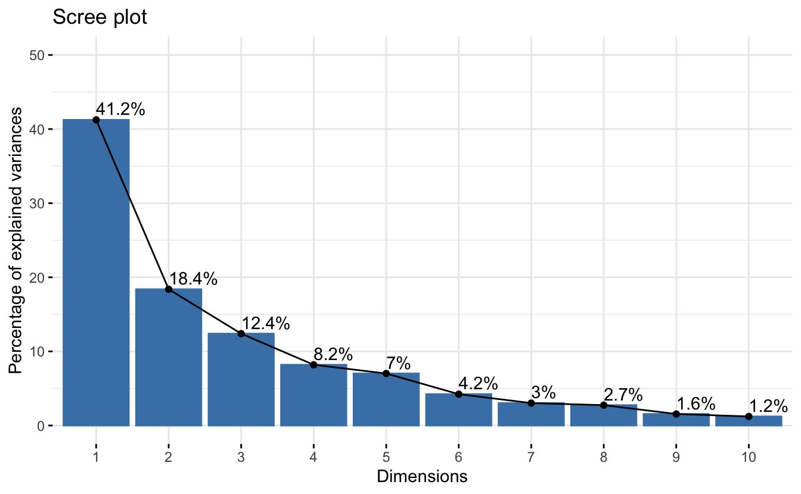
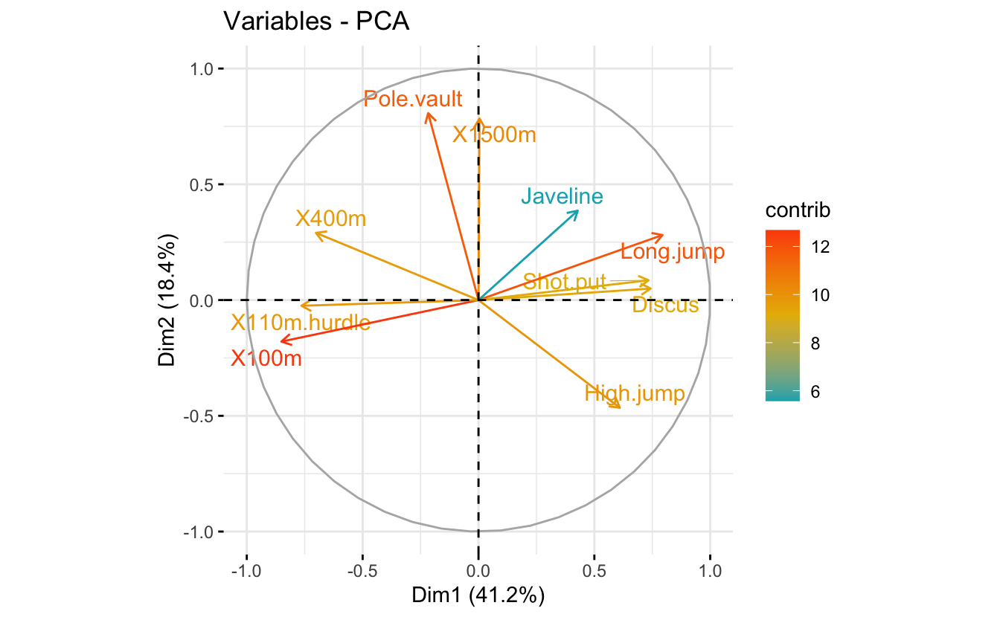
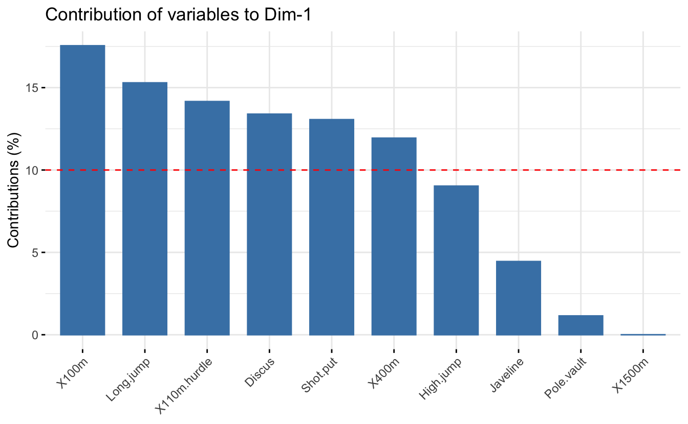
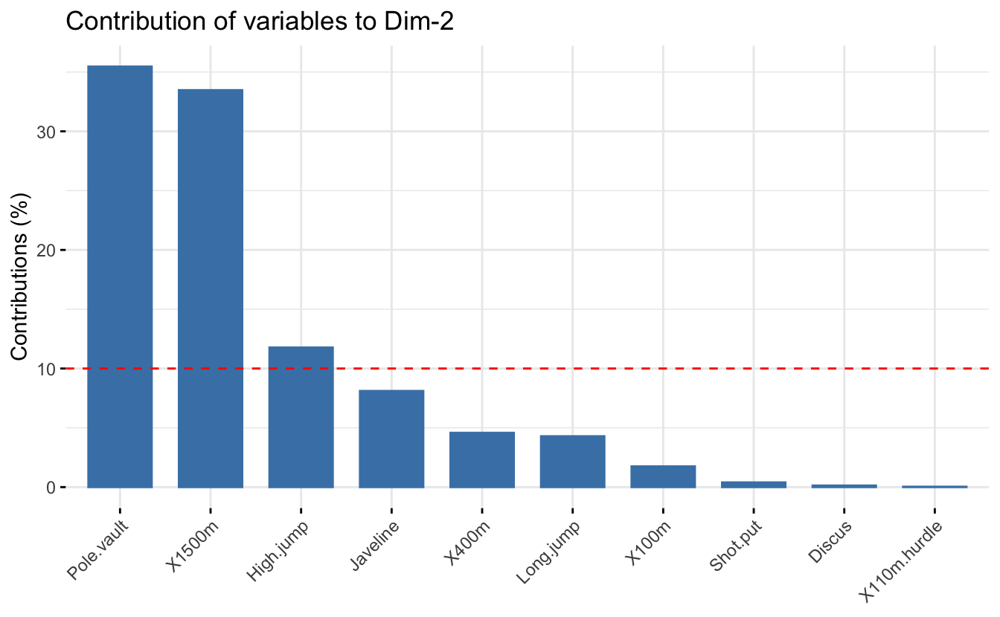
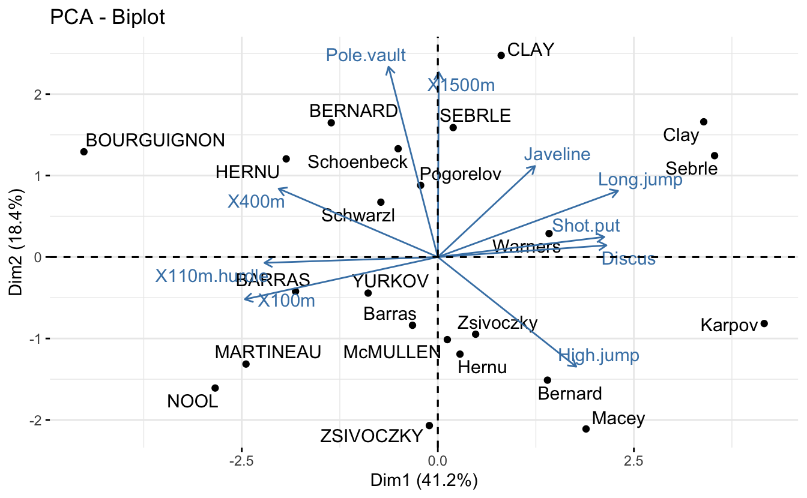

Introducción
------------

El **análisis de componentes principales (PCA)** nos permite resumir y visualizar la información en un conjunto de datos que contiene individuos/observaciones descritos por múltiples variables cuantitativas inter-correlacionadas. Cada variable podría considerarse como una dimensión diferente. Si tiene más de 3 variables en sus conjuntos de datos, podría ser muy difícil visualizar un hiperespacio multidimensional.

El análisis de componentes principales se utiliza para extraer la información importante de una tabla de datos multivariados y para expresar esta información como un conjunto de algunas variables nuevas llamadas **componentes principales**. Estas nuevas variables corresponden a una combinación lineal de las originales. El número de componentes principales es menor o igual al número de variables originales.

La información de un conjunto de datos dado corresponde a la *variación total* que contiene. El objetivo de PCA es identificar direcciones (o componentes principales) a lo largo de los cuales la variación en los datos es máxima.

En otras palabras, PCA reduce la dimensionalidad de un dato multivariado a dos o tres componentes principales, que se pueden visualizar gráficamente, con una mínima pérdida de información.

> En este capítulo, describimos la idea básica de PCA y demostramos cómo calcular y visualizar PCA usando el software R. Además, mostraremos cómo identificar las variables más importantes que explican las variaciones en un conjunto de datos.

En conjunto, el objetivo principal del análisis de componentes principales es:

> -   identificar patrones ocultos en un conjunto de datos,
> -   reducir la dimensionalidad de los datos **eliminando el ruido** y la **redundancia** en los datos,
> -   identificar variables correlacionadas

Metodología de análisis
-----------------------

Instale los dos paquetes de la siguiente manera:

<pre class='chroma'><code class='language-r' data-lang='r'><a href='https://rdrr.io/r/utils/install.packages.html'>install.packages</a>(<a href='https://rdrr.io/r/base/c.html'>c</a>("FactoMineR", "factoextra"))
</code></pre>

Cargar paquetes en R:

<pre class='chroma'><code class='language-r' data-lang='r'><a href='https://rdrr.io/r/base/library.html'>library</a>(<a href='http://factominer.free.fr'>"FactoMineR"</a>)
<a href='https://rdrr.io/r/base/library.html'>library</a>(<a href='http://www.sthda.com/english/rpkgs/factoextra'>"factoextra"</a>)

#&gt; Loading required package: ggplot2

#&gt; Welcome! Want to learn more? See two factoextra-related books at https://goo.gl/ve3WBa
</code></pre>

### Cargando datos

Usaremos los conjuntos de datos de demostración **decathlon2** del paquete `factoextra`:

<pre class='chroma'><code class='language-r' data-lang='r'><a href='https://rdrr.io/r/utils/data.html'>data</a>(decathlon2)
#head(decathlon2)
</code></pre>

De esta base de datos seleccionamos variables cuantitativas para el análisis de componentes principales:

<pre class='chroma'><code class='language-r' data-lang='r'>#seleccionamos 27 filas y las primeras 10 variables
decathlon2.active &lt;- decathlon2[1:23, 1:10]
<a href='https://rdrr.io/r/utils/head.html'>head</a>(decathlon2.active[, 1:7], 4)

#&gt;         X100m Long.jump Shot.put High.jump X400m X110m.hurdle Discus
#&gt; SEBRLE  11.04      7.58    14.83      2.07 49.81        14.69  43.75
#&gt; CLAY    10.76      7.40    14.26      1.86 49.37        14.05  50.72
#&gt; BERNARD 11.02      7.23    14.25      1.92 48.93        14.99  40.87
#&gt; YURKOV  11.34      7.09    15.19      2.10 50.42        15.31  46.26
</code></pre>

### Código R

Se puede utilizar la función [`PCA()`](https://rdrr.io/pkg/FactoMineR/man/PCA.html) \[paquete *FactoMineR*\]. Un formato simplificado es:

<pre class='chroma'><code class='language-r' data-lang='r'><a href='https://rdrr.io/pkg/FactoMineR/man/PCA.html'>PCA</a>(X, scale.unit = TRUE, ncp = 5, graph = TRUE)
</code></pre>

> -   **X**: un marco de datos. Las filas son individuos y las columnas son variables numéricas
> -   **scale.unit**: un valor lógico. Si es `TRUE`, los datos se escalan a la varianza de la unidad antes del análisis. Esta estandarización a la misma escala evita que algunas variables se conviertan en dominantes solo por sus grandes unidades de medida. Hace que la variable sea comparable.
> -   **ncp**: número de dimensiones mantenidas en los resultados finales.
> -   **graph**: un valor lógico. Si es `TRUE`, se muestra un gráfico.

El código R a continuación, calcula el análisis de componentes principales de las variables seleccionadas o activas:

<pre class='chroma'><code class='language-r' data-lang='r'><a href='https://rdrr.io/r/base/library.html'>library</a>(<a href='http://factominer.free.fr'>"FactoMineR"</a>)
res.pca &lt;- <a href='https://rdrr.io/pkg/FactoMineR/man/PCA.html'>PCA</a>(decathlon2.active, graph = FALSE)
</code></pre>

> El objeto que se crea usando la función [`PCA()`](https://rdrr.io/pkg/FactoMineR/man/PCA.html) contiene mucha información que se encuentra en muchas listas y matrices diferentes. Estos valores se describen en la siguiente sección.

### Extraiga y visualice valores propios/varianzas:

Los valores propios o varianzas miden la cantidad de variación retenida por cada componente principal. Las varianzas son grandes para los primeros componentes y pequeños para las siguientes. Es decir, las primeras PC corresponden a las direcciones con la cantidad máxima de variación en el conjunto de datos.

<pre class='chroma'><code class='language-r' data-lang='r'># Extraer valores propios/varianzas
<a href='https://rdrr.io/pkg/factoextra/man/eigenvalue.html'>get_eig</a>(res.pca)

#&gt;        eigenvalue variance.percent cumulative.variance.percent
#&gt; Dim.1   4.1242133        41.242133                    41.24213
#&gt; Dim.2   1.8385309        18.385309                    59.62744
#&gt; Dim.3   1.2391403        12.391403                    72.01885
#&gt; Dim.4   0.8194402         8.194402                    80.21325
#&gt; Dim.5   0.7015528         7.015528                    87.22878
#&gt; Dim.6   0.4228828         4.228828                    91.45760
#&gt; Dim.7   0.3025817         3.025817                    94.48342
#&gt; Dim.8   0.2744700         2.744700                    97.22812
#&gt; Dim.9   0.1552169         1.552169                    98.78029
#&gt; Dim.10  0.1219710         1.219710                   100.00000

# Visualizar valores propios/variaciones
<a href='https://rdrr.io/pkg/factoextra/man/eigenvalue.html'>fviz_screeplot</a>(res.pca, addlabels = TRUE, ylim = <a href='https://rdrr.io/r/base/c.html'>c</a>(0, 50))

</code></pre>

La suma de todos los valores propios da una varianza total de 10.

La proporción de variación explicada por cada valor propio se da en la segunda columna. Por ejemplo, 4,124 dividido por 10 es igual a 0,4124, o aproximadamente el 41,24% de la variación se explica por este primer valor propio. El porcentaje acumulado explicado se obtiene sumando las sucesivas proporciones de variación explicadas para obtener el total acumulado. Por ejemplo, 41,242% más 18,385% es igual a 59,627%, y así sucesivamente. Por lo tanto, aproximadamente el 59,627% de la variación se explica por los dos primeros valores propios juntos.

Los valores propios se pueden utilizar para determinar la cantidad de componentes principales que se deben retener después de la PCA (Kaiser 1961):

> -   Un *valor propio* \> 1 indica que los PCs representan más varianza que la contabilizada por una de las variables originales en los datos estandarizados. Esto se usa comúnmente como un punto de corte para el cual se retienen las PCs. Esto es válido solo cuando los datos están estandarizados.
> -   También puede limitar el número de componentes a ese número que representa una cierta fracción de la varianza total. Por ejemplo, si está satisfecho con el 70% de la varianza total explicada, utilice el número de componentes para lograrlo.

Desafortunadamente, no existe una forma objetiva bien aceptada de decidir cuántos componentes principales son suficientes. Esto dependerá del campo de aplicación específico y del conjunto de datos específico. En la práctica, tendemos a mirar los primeros componentes principales para encontrar patrones interesantes en los datos.

En nuestro análisis, los tres primeros componentes principales explican el 72% de la variación. Este es un porcentaje aceptablemente grande.

### Gráfica círculo de correlación

La correlación entre una variable y un componente principal (PC) se utiliza como coordenadas de la variable en la PC. La representación de las variables difiere del gráfico de las observaciones: las observaciones están representadas por sus proyecciones, pero las variables están representadas por sus correlaciones (Abdi y Williams 2010).

Es posible controlar los colores de las variables usando sus contribuciones ("contrib") a los ejes principales:

<pre class='chroma'><code class='language-r' data-lang='r'># Control variable colors using their contributions
<a href='https://rdrr.io/pkg/factoextra/man/fviz_pca.html'>fviz_pca_var</a>(res.pca, col.var="contrib",
             gradient.cols = <a href='https://rdrr.io/r/base/c.html'>c</a>("#00AFBB", "#E7B800", "#FC4E07"),
             repel = TRUE # Avoid text overlapping
             )

</code></pre>

La gráfica anterior también se conoce como gráficas de correlación variable. Muestra las relaciones entre todas las variables. Se puede interpretar de la siguiente manera:

-   Las variables correlacionadas positivamente se agrupan.
-   Las variables correlacionadas negativamente se colocan en lados opuestos del origen de la gráfica (cuadrantes opuestos).
-   La distancia entre las variables y el origen mide la calidad de las variables en el mapa de factores. Las variables que están lejos del origen están bien representadas en el mapa de factores.

### Contribucion de las variables a los ejes principales:

<pre class='chroma'><code class='language-r' data-lang='r'># Contributions of variables to PC1
<a href='https://rdrr.io/pkg/factoextra/man/fviz_contrib.html'>fviz_contrib</a>(res.pca, choice = "var", axes = 1, top = 10)

</code></pre>

<pre class='chroma'><code class='language-r' data-lang='r'>
# Contributions of variables to PC2
<a href='https://rdrr.io/pkg/factoextra/man/fviz_contrib.html'>fviz_contrib</a>(res.pca, choice = "var", axes = 2, top = 10)

</code></pre>

La línea discontinua roja en el gráfico anterior indica la contribución promedio esperada. Si la contribución de las variables fuera uniforme, el valor esperado sería 1/longitud(variables) = 1/10 = 10%. Para un componente dado, una variable con una contribución mayor que este límite podría considerarse importante para contribuir al componente.

> Se puede observar que las variables `X100m`, `Long.jump` y `Pole.vault` contribuyen más a las dimensiones 1 y 2.

### Biplot

Para hacer un biplot simple de individuos y variables, escriba esto:

<pre class='chroma'><code class='language-r' data-lang='r'># Biplot of individuals and variables
<a href='https://rdrr.io/pkg/factoextra/man/fviz_pca.html'>fviz_pca_biplot</a>(res.pca, repel = TRUE)

</code></pre>

En biplot, debe centrarse principalmente en la dirección de las variables pero no en sus posiciones absolutas en la gráfica.

En términos generales, un biplot se puede interpretar de la siguiente manera:

-   un individuo que está en el mismo lado de una variable dada tiene un valor alto para esta variable;
-   un individuo que está en el lado opuesto de una variable dada tiene un valor bajo para esta variable.

Nota: Este post fue extraido del libro **"Multivariate Analisis II"**

Referencias
-----------

Kassambara A. 2017. Multivariate Analysis: Practical Guide to Principal Component Methods in R.

