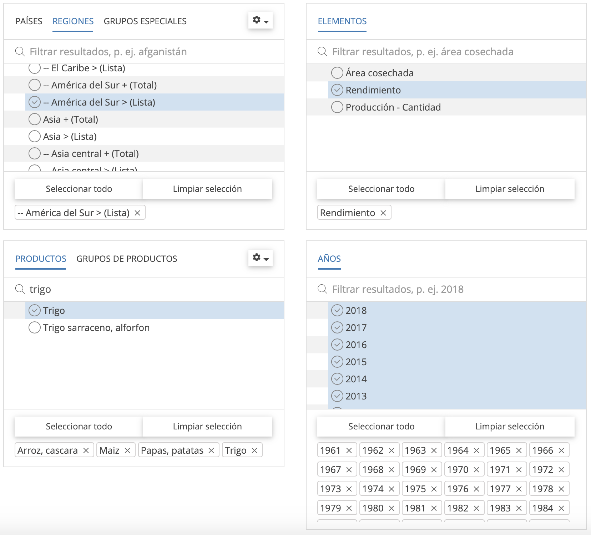

## **Introducción**

`Extraer`, `ordenar` y `graficar` datos es una tarea que demanda tiempo y cierta habilidad informática. Generalmente, muchos investigadores buscamos datos históricos para observar `tendencias` de *rendimiento*, *producción* y *superficie cultivada*, esto con el propósito de soportar diferentes `investigaciones` del área. Para realizar estas tareas existen diferentes bases de datos de libre acceso, entre ellos está [FAOSTAT](http://www.fao.org/faostat/es/#home). Esta organización proporciona *acceso libre* a datos sobre **alimentación y agricultura** de más de 245 países y 35 regiones, desde 1961 hasta el año más reciente disponible. 

Los datos de FAOSTAT habitualmente son descargados en planillas de `Microsoft Excel` y en ésta se va limpiando de forma manual hasta que el resumen de datos sea presentable. Esta actividad requiere tiempo; sin embargo, existen herramientas de programación que pueden `automatizar` este proceso y reducir tiempo en ordenar datos. Una de ellas es [**R**](https://www.r-project.org), la cual es un *lenguaje de programación* y un ambiente de *software libre* para la **ciencia de datos**. Por tanto, nuestro objetivo es `extraer` y `ordenar` datos de la página web de `FAOSTAT` con el uso del paquete `Tidyverse` en el ambiente `R`.

## **Extracción**

Para acceder a FAOSTAT, diríjase al sitio web oficial a traves del enlace <http://www.fao.org/faostat/en/#home>. En la página principal tiene la opción de cambiar el idioma del ingles al español y haga clic en `Acceder a los datos`. Una vez que acceda a esta ventana, haga clic en `cultivos` en la sección de `Producción`, en la cual observará la vista de selección y `descargar datos`. En esta ventana seleccionamos la base de datos a descargar. Para esto siga los siguientes pasos:



* Seleccione **países** o **regiones** de interes, en nuestro caso hacemos clic en `regiones` y elegimos los países de `América del Sur`.
* En la subventana de `elementos` puede seleccionar `Área cosechada` (superficie cultivada), `Rendimiento` y `Producción`. Para nuestro ejemplo elegimos *rendimiento*.
* El siguiente paso es seleccionar los cultivos o `productos` de interes. En nuestro caso elegimos cuatro cultivos (arroz, maíz, papa y trigo).
* En la última subventana seleccione los `Años` de interes. Para nuestro ejemplo elegimos todos los años, esto con el propósito de hacer comparación de la tendencia de rendimiento en los países de latinoamérica.
* El último paso es `descargar` los datos seleccionados. Para esto, la salida de datos debe estar seleccionado en formato `Tabla`, tipo de archivo `CSV` y hacer clic en `Descargar Datos` para guardar en un archivo de proyecto.

## **Ordenación**

A partir de esta etapa se usará la consola de **R** a traves del entorno [RStudio](https://rstudio.com). Para ordenar los datos es recomendable usar el paquete [tidyverse](https://www.tidyverse.org), la cual es una colección obstinada de paquetes R diseñados para la ciencia de datos. Para instalar use este código `install.packages("tidyverse")`.

Para proceder con la ordenación de datos, analizar y/o generar otro tipo de actividades con R, recomiendo crear un proyecto a traves de `RStudio`. Esto facilita el flujo de trabajo dentro de R. Posterior a ello, llame al paquete `tidyverse`:

```{r, message=FALSE, warning=FALSE}
library(tidyverse)
```

Para iniciar con el trabajo es necesario que los datos descargados de FAOSTAT se encuentre dentro de los archivos del proyecto.

Para llamar los datos al entorno de R use la siguiente función:

```{r, message=FALSE}
key_crops <- read_csv("FAOSTAT_data_11-18-2020.csv")
```

Para verificar el marco de datos en el ambiente R, ejecute la variable `key_crops`. 

```{r}
key_crops
```

En esta salida puede observar `2657` filas u observaciones y `14` columnas o variables. Asimismo, puede verificar los `formatos` de cada variable. Esta base de datos no facilita el uso apropiado para realizar un resumen descriptivo o generar gráficas para observar tendencias.

### Ordenando base de datos

Para este proceso se identificó que la columna de `Area` contiene países de América del Sur; sin embargo, en estas obsevarciones Bolivia tiene texto adicional "`Bolivia (Plurinational State of)`". Para eliminar el texto adicional se usa la función `separate(Area, c("country"), sep = " ")`, el mismo proceso se aplica para `Rice, paddy` en la columa de cultivos `Item`. A partir de la columna `Value` se creó otra columna `mutate(yield = Value / 10000)`, en la cual se hizo la conversión de hectogramos (hg ha^-1^) a toneladas (t ha^-1^). El siguiente paso fue seleccionar cuatro variables de la base de datos `select(country, crop, Year, yield)` y al finalizar este proceso se filtró los países más próximos a Bolivia. 

```{r, warning=FALSE}
long_crops <- key_crops %>% 
  separate(Area, c("country"), sep = " ") %>%
  separate(Item, c("crop"), sep = ",") %>%
  mutate(yield = Value / 10000) %>%
  select(country, crop, Year, yield) %>%
  filter(country %in% c("Argentina", 
                        "Bolivia", 
                        "Brazil",
                        "Chile",
                        "Paraguay",
                        "Peru",
                        "Uruguay")
  )
```

Podemos observar los datos ordenados ejecutando `long_crops`
```{r}
long_crops
```

Estos datos tienen 1624 filas y 4 columnas, las cuales estan ordenadas y listas para generar gráficas interactivas o estáticas.

## **Graficando los datos**

Generar gráficas es muy importante, ya que es más cómodo interpretar, analizar tendencias o identificar asociaciones. Debido a ello, se realizó una figura multipanel.

```{r}
long_crops %>%
  ggplot(aes(Year, yield, color = country)) +
  geom_line() +
  facet_wrap(~crop, ncol = 2) +
  labs(x = "Year", y = "Yield (t ha)")
```

En la figura, se observa tendencias de rendimiento a traves del tiempo que corresponden para los cuatro cultivos. Por ejemplo, el rendimiento de papa en Argentina tiende a incrmentar 10 t ha^-1^ cada 20 años; sin embargo, en Bolivia las tendencias de rendimiento son constantes o sea no hay un incremento pronunciado a compararación de los países vecinos.

También se puede realizar una gráfica para el último año. Para ello, se filtró el año 2018 de la base de datos `long_crops` con la función `filter(Year == 2018)`. Con estos datos, se generó una gráfica de barras.

```{r}
yearfs <- long_crops %>%
  filter(Year == 2018)

# seleccion de tema para la gráfica
theme_set(
  theme_classic() +
    theme(legend.position = "top")
)

#Generando gráfica de barras
ggplot(yearfs, aes(x=country, y=yield, fill=crop)) +
  geom_bar(stat="identity", position = position_dodge()) +
  labs(x = "Países", y = "Yield (t ha)")
```

En esta figura se puede observar rendimientos de cuatro cultivos para el año 2018. En la cual, Argentina, Chile y Brasil tuvieron mayores rendimientos en el cultivo de papa; sin embargo, Bolivia se ubica en el último puesto en cuanto a rendimientos en los cuatro cultivos.

## **Conclusión**

Los usuarios de R pueden generar scripts reproducibles a base de este post. Extraer, ordenar y graficar datos con R, facilita obtener datos limpios y es más eficiente con los tiempos de trabajo.

