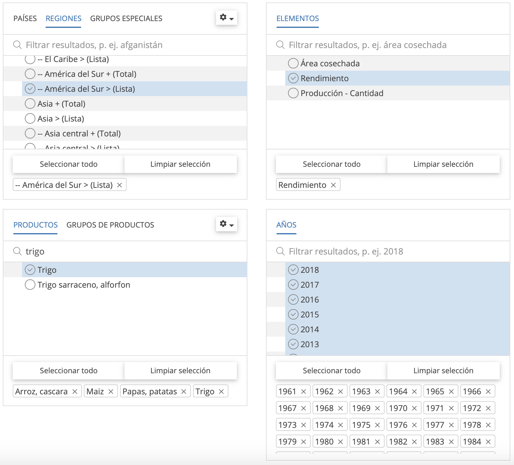
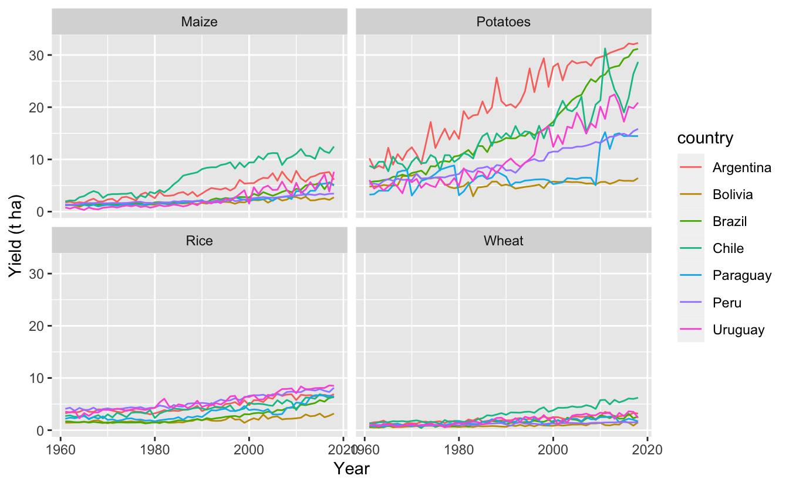
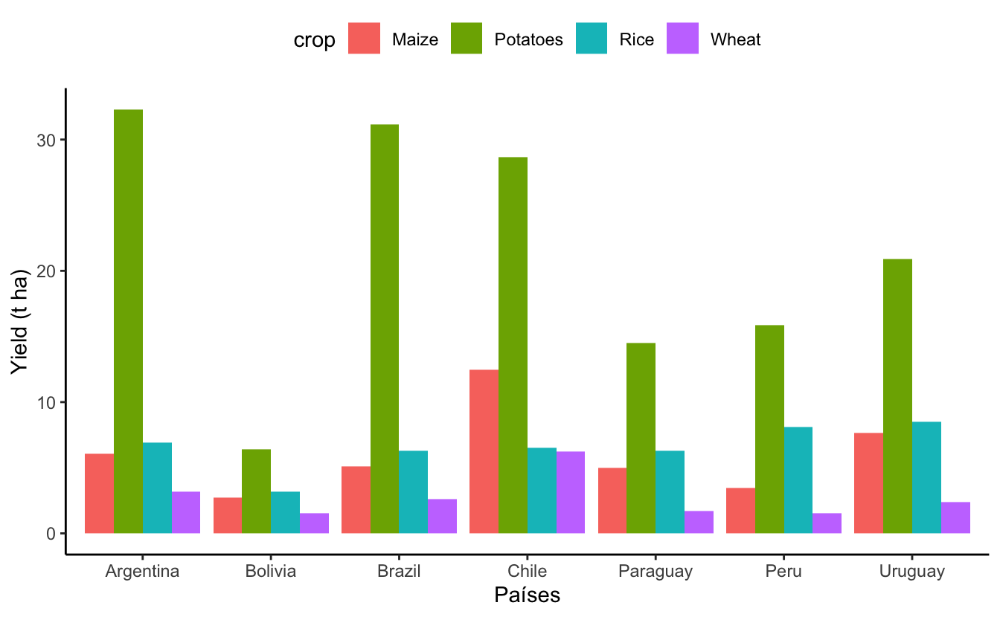

**Introducción**
----------------

`Extraer`, `ordenar` y `graficar` datos es una tarea que demanda tiempo y cierta habilidad informática. Generalmente, muchos investigadores buscamos datos históricos para observar `tendencias` de *rendimiento*, *producción* y *superficie cultivada*, esto con el propósito de soportar diferentes `investigaciones` del área. Para realizar estas tareas existen diferentes bases de datos de libre acceso, entre ellos está [FAOSTAT](http://www.fao.org/faostat/es/#home). Esta organización proporciona *acceso libre* a datos sobre **alimentación y agricultura** de más de 245 países y 35 regiones, desde 1961 hasta el año más reciente disponible.

Los datos de FAOSTAT habitualmente son descargados en planillas de `Microsoft Excel` y en ésta se va limpiando de forma manual hasta que el resumen de datos sea presentable. Esta actividad requiere tiempo; sin embargo, existen herramientas de programación que pueden `automatizar` este proceso y reducir tiempo en ordenar datos. Una de ellas es [**R**](https://www.r-project.org), la cual es un *lenguaje de programación* y un ambiente de *software libre* para la **ciencia de datos**. Por tanto, nuestro objetivo es `extraer` y `ordenar` datos de la página web de `FAOSTAT` con el uso del paquete `Tidyverse` en el ambiente `R`.

**Extracción**
--------------

Para acceder a FAOSTAT, diríjase al sitio web oficial a traves del enlace <a href="http://www.fao.org/faostat/en/#home" class="uri">http://www.fao.org/faostat/en/#home</a>. En la página principal tiene la opción de cambiar el idioma del ingles al español y haga clic en `Acceder a los datos`. Una vez que acceda a esta ventana, haga clic en `cultivos` en la sección de `Producción`, en la cual observará la vista de selección y `descargar datos`. En esta ventana seleccionamos la base de datos a descargar. Para esto siga los siguientes pasos:

-   Seleccione **países** o **regiones** de interes, en nuestro caso hacemos clic en `regiones` y elegimos los países de `América del Sur`.
-   En la subventana de `elementos` puede seleccionar `Área cosechada` (superficie cultivada), `Rendimiento` y `Producción`. Para nuestro ejemplo elegimos *rendimiento*.
-   El siguiente paso es seleccionar los cultivos o `productos` de interes. En nuestro caso elegimos cuatro cultivos (arroz, maíz, papa y trigo).
-   En la última subventana seleccione los `Años` de interes. Para nuestro ejemplo elegimos todos los años, esto con el propósito de hacer comparación de la tendencia de rendimiento en los países de latinoamérica.
-   El último paso es `descargar` los datos seleccionados. Para esto, la salida de datos debe estar seleccionado en formato `Tabla`, tipo de archivo `CSV` y hacer clic en `Descargar Datos` para guardar en un archivo de proyecto.

**Ordenación**
--------------

A partir de esta etapa se usará la consola de **R** a traves del entorno [RStudio](https://rstudio.com). Para ordenar los datos es recomendable usar el paquete [tidyverse](https://www.tidyverse.org), la cual es una colección obstinada de paquetes R diseñados para la ciencia de datos. Para instalar use este código [`install.packages("tidyverse")`](https://rdrr.io/r/utils/install.packages.html).

Para proceder con la ordenación de datos, analizar y/o generar otro tipo de actividades con R, recomiendo crear un proyecto a traves de `RStudio`. Esto facilita el flujo de trabajo dentro de R. Posterior a ello, llame al paquete `tidyverse`:

<pre class='chroma'><code class='language-r' data-lang='r'><a href='https://rdrr.io/r/base/library.html'>library</a>(<a href='http://tidyverse.tidyverse.org'>tidyverse</a>)
</code></pre>

Para iniciar con el trabajo es necesario que los datos descargados de FAOSTAT se encuentre dentro de los archivos del proyecto.

Para llamar los datos al entorno de R use la siguiente función:

<pre class='chroma'><code class='language-r' data-lang='r'>key_crops &lt;- read_csv("FAOSTAT_data_11-18-2020.csv")
</code></pre>

Para verificar el marco de datos en el ambiente R, ejecute la variable `key_crops`.

<pre class='chroma'><code class='language-r' data-lang='r'>key_crops

#&gt; # A tibble: 2,657 x 14
#&gt;    `Domain Code` Domain `Area Code` Area  `Element Code` Element `Item Code`
#&gt;    &lt;chr&gt;         &lt;chr&gt;        &lt;dbl&gt; &lt;chr&gt;          &lt;dbl&gt; &lt;chr&gt;         &lt;dbl&gt;
#&gt;  1 QC            Crops            9 Arge…           5419 Yield            56
#&gt;  2 QC            Crops            9 Arge…           5419 Yield            56
#&gt;  3 QC            Crops            9 Arge…           5419 Yield            56
#&gt;  4 QC            Crops            9 Arge…           5419 Yield            56
#&gt;  5 QC            Crops            9 Arge…           5419 Yield            56
#&gt;  6 QC            Crops            9 Arge…           5419 Yield            56
#&gt;  7 QC            Crops            9 Arge…           5419 Yield            56
#&gt;  8 QC            Crops            9 Arge…           5419 Yield            56
#&gt;  9 QC            Crops            9 Arge…           5419 Yield            56
#&gt; 10 QC            Crops            9 Arge…           5419 Yield            56
#&gt; # … with 2,647 more rows, and 7 more variables: Item &lt;chr&gt;, `Year Code` &lt;dbl&gt;,
#&gt; #   Year &lt;dbl&gt;, Unit &lt;chr&gt;, Value &lt;dbl&gt;, Flag &lt;chr&gt;, `Flag Description` &lt;chr&gt;
</code></pre>

En esta salida puede observar `2657` filas u observaciones y `14` columnas o variables. Asimismo, puede verificar los `formatos` de cada variable. Esta base de datos no facilita el uso apropiado para realizar un resumen descriptivo o generar gráficas para observar tendencias.

### Ordenando base de datos

Para este proceso se identificó que la columna de `Area` contiene países de América del Sur; sin embargo, en estas obsevarciones Bolivia tiene texto adicional "`Bolivia (Plurinational State of)`". Para eliminar el texto adicional se usa la función `separate(Area, c("country"), sep = " ")`, el mismo proceso se aplica para `Rice, paddy` en la columa de cultivos `Item`. A partir de la columna `Value` se creó otra columna `mutate(yield = Value / 10000)`, en la cual se hizo la conversión de hectogramos (hg ha-1) a toneladas (t ha-1). El siguiente paso fue seleccionar cuatro variables de la base de datos `select(country, crop, Year, yield)` y al finalizar este proceso se filtró los países más próximos a Bolivia.

<pre class='chroma'><code class='language-r' data-lang='r'>long_crops &lt;- key_crops %&gt;% 
  separate(Area, <a href='https://rdrr.io/r/base/c.html'>c</a>("country"), sep = " ") %&gt;%
  separate(Item, <a href='https://rdrr.io/r/base/c.html'>c</a>("crop"), sep = ",") %&gt;%
  mutate(yield = Value / 10000) %&gt;%
  select(country, crop, Year, yield) %&gt;%
  <a href='https://rdrr.io/r/stats/filter.html'>filter</a>(country %in% <a href='https://rdrr.io/r/base/c.html'>c</a>("Argentina", 
                        "Bolivia", 
                        "Brazil",
                        "Chile",
                        "Paraguay",
                        "Peru",
                        "Uruguay")
  )
</code></pre>

Podemos observar los datos ordenados ejecutando `long_crops`

<pre class='chroma'><code class='language-r' data-lang='r'>long_crops

#&gt; # A tibble: 1,624 x 4
#&gt;    country   crop   Year yield
#&gt;    &lt;chr&gt;     &lt;chr&gt; &lt;dbl&gt; &lt;dbl&gt;
#&gt;  1 Argentina Maize  1961  1.77
#&gt;  2 Argentina Maize  1962  1.89
#&gt;  3 Argentina Maize  1963  1.65
#&gt;  4 Argentina Maize  1964  1.80
#&gt;  5 Argentina Maize  1965  1.68
#&gt;  6 Argentina Maize  1966  2.15
#&gt;  7 Argentina Maize  1967  2.47
#&gt;  8 Argentina Maize  1968  1.94
#&gt;  9 Argentina Maize  1969  1.93
#&gt; 10 Argentina Maize  1970  2.33
#&gt; # … with 1,614 more rows
</code></pre>

Estos datos tienen 1624 filas y 4 columnas, las cuales estan ordenadas y listas para generar gráficas interactivas o estáticas.

**Graficando los datos**
------------------------

Generar gráficas es muy importante, ya que es más cómodo interpretar, analizar tendencias o identificar asociaciones. Debido a ello, se realizó una figura multipanel.

<pre class='chroma'><code class='language-r' data-lang='r'>long_crops %&gt;%
  ggplot(aes(Year, yield, color = country)) +
  geom_line() +
  facet_wrap(~crop, ncol = 2) +
  labs(x = "Year", y = "Yield (t ha)")

</code></pre>

En la figura, se observa tendencias de rendimiento a traves del tiempo que corresponden para los cuatro cultivos. Por ejemplo, el rendimiento de papa en Argentina tiende a incrmentar 10 t ha-1 cada 20 años; sin embargo, en Bolivia las tendencias de rendimiento son constantes o sea no hay un incremento pronunciado a compararación de los países vecinos.

También se puede realizar una gráfica para el último año. Para ello, se filtró el año 2018 de la base de datos `long_crops` con la función [`filter(Year == 2018)`](https://rdrr.io/r/stats/filter.html). Con estos datos, se generó una gráfica de barras.

<pre class='chroma'><code class='language-r' data-lang='r'>yearfs &lt;- long_crops %&gt;%
  <a href='https://rdrr.io/r/stats/filter.html'>filter</a>(Year == 2018)

# seleccion de tema para la gráfica
theme_set(
  theme_classic() +
    theme(legend.position = "top")
)

#Generando gráfica de barras
ggplot(yearfs, aes(x=country, y=yield, fill=crop)) +
  geom_bar(stat="identity", position = position_dodge()) +
  labs(x = "Países", y = "Yield (t ha)")

</code></pre>

En esta figura se puede observar rendimientos de cuatro cultivos para el año 2018. En la cual, Argentina, Chile y Brasil tuvieron mayores rendimientos en el cultivo de papa; sin embargo, Bolivia se ubica en el último puesto en cuanto a rendimientos en los cuatro cultivos.

**Conclusión**
--------------

Los usuarios de R pueden generar scripts reproducibles a base de este post. Extraer, ordenar y graficar datos con R, facilita obtener datos limpios y es más eficiente con los tiempos de trabajo.

